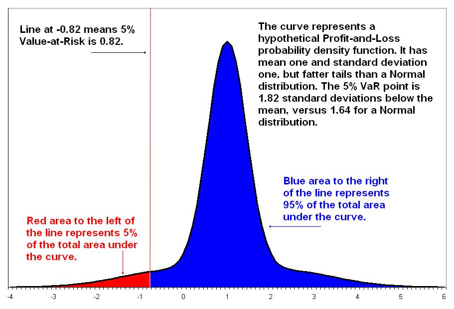

# Quantitative Trading

---
Data Sources:
* Yahoo Finance
* EOD Historical Data
* Finnhub
---

# Stock Prices

* **Stock**: An asset that represents ownership in a company. A claim on part of a corportation's assets and earnings. There are two main types, common and preferred.

* **Share**: A single share represents partial ownership of a company relative to the total number of shares in existence.

* **Common Stock**: One main type of stock; entitles the owner to receive dividends and to vote at shareholder meetings.

* **Preferred Stock**: The other main type of stock; generally does not entail voting rights, but entitles the owner to a higher claim on the assets and earnings of a company.

* **Dividend**: A partial distribution of a company's profits to shareholders.

* **Capital Gains**: Profits that result from the sale of an asset at a price higher than the purchase price.

* **Security**: A tradable financial asset.

* **Debt Security**: Money that is owed and must be repaid, like government or corporate bonds, or certificates of deposit. Also called fixed-income securities.

* **Derivative Security**: A financial instrument whereby its value is derived from other assets.

* **Equity**: The value of an owned asset minus the amount of all debts on that asset.

* **Equity Security**: A security that represents fractional ownership in an entity, such as stock.

* **Option Contract**: A contract which gives the buyer the right, but not the obligation, to buy or sell an underlying asset at a specified price on or by a specified date

* **Futures Contract**: A contract that obligates the buyer to buy or the seller to sell an asset at a predetermined price at a specified time in the future

**Liquidity**: The ability to trade an asset at a stable price.

**Options: calls, puts, American, European**
Options give the owner the right to buy or sell at the strike price (a fixed price that is determined when the option is created), on or before an expiration date. The most common are call options and put options. Call options give the right to buy at the strike price; put options give the owner the right to sell at a fixed price. Some options allow the holder to “exercise” (buy or sell) at the strike price any time up to the expiration date. These are called “American options” by convention, even though this doesn’t mean that the options are traded in the Americas. Another class of options only allows the holder to exercise the option at the expiration date, but not earlier. These are called “European options” by convention, but again, European options don’t necessarily have to be traded in Europe.

**Forwards and Futures**
Futures and forwards contracts are similar, in that a buyer and seller both agree to make a future transaction at a predetermined price. Futures are standardized contracts that can be traded on a futures exchange, so this may be what people think of when discussing “forwards and futures”. Forward contracts are usually privately determined contracts between two parties. So an investor can trade futures contracts, but forward contracts are not designed to be traded like futures.

**Public versus private equity**
Public equity refers to stocks that can be traded on a stock exchange. Private equity refers to ownership in private companies, so the owners of private equity do not trade their shares on a stock exchange. Our course is primarily focused on public equity, which we’ll refer to as stocks, since the ability to buy and sell freely enables us to adjust our investments based on new or time-sensitive information.

# Market Mechanics

* Stocks data lacks weekend and publics holidays which left uncheck can bias results

* Some stocks are listed in differet stock exchanges market in different time zones, so for ex. if aparticular stock raises in Hong Kong it may also raise some hours later in London too.

**Buy Side and Sell Side**
We’ve just seen that there are buyers and sellers who go through the stock exchange to buy a stock that they think will do well, or sell a stock that they wish to remove from their investments. We’ve also introduced the market maker, who serves as the counterparty of these buyers or sellers. Since every buyer needs a seller, and every seller needs a buyer, a market maker plays the role of seller to those who wish to buy, and plays the role of buyer for those who wish to sell. By convention, we refer to these market makers as the “sell side” of the finance industry. The sell side includes investment banks such as Goldman Sachs and Morgan Stanley. The buy side refers to individual investors, and investment funds such as mutual funds and hedge funds. This Nanodegree is focused on the perspective of the “buy side”. However, it’s good to learn about the “sell side”, because these are the people that the “buy side” usually does business when they enter the market to buy or sell stocks. We’ll see an important role that the “sell side” market makers play in the next video.

**Note**: Pre-market sessions (for the US market) are a period of time where stocks are very thinly traded. Market participants often use this to gauge the strength and direction of the market. Post-market sessions are often used by traders who want to trade on corporate announcements made after market closes, or for brokers to make whole of an incomplete client order.

**Note on ADR**: Foreign stocks are sometimes allowed to trade on a local stock exchange via an indirect method such as American Depository Receipts (ADR). These are instruments that represent the original stock in a different market.

# Data Processing

**Note** : Tick data is sometimes referred to as heterogeneous data, since it is not sampled at regular time intervals, whereas Minute-level or End-of-Day data is called homogeneous. Converting heterogeneous data to a homogeneous form can be a good exercise!

* Ech moment in trading data is called **tick**

* Contains time of the event, symbol or ticker traded, trade data (last trade or price, volume) and quote data (bid size, bid, ask size, ask)

* **Corporate actions**: 

    1. Stock splits: create more shares, which divides/dilutes the value per share
    2. Dividends
   
**Note**: Moving-window or “rolling” statistics are typically calculated with respect to a past period. Therefore, you won’t have a valid value at the beginning of the resulting time series, till you have one complete period. For instance, when you compute the Simple Moving Average with a 1-month or 30-day window, the result is undefined for the first 29 days. This is okay, and smart data analysis libraries like Pandas will mark these with a special “NA” or “nan” value (not zero, because that would be indiscernible from an actual zero value!). Subsequent processing or plotting will interpret those as missing data points.

## Stock Splits

Total Market Capitalization = Stock Price x Total Number of Shares Outstanding

Problem with **Stock Splits**: it makes it look like the price has dropped because tge value of the company has dropped. If you adjust the price by diving by the Stock Split ratio, it's called **Adjusted Price**.

**Comment**: Although a stock split shouldn’t theoretically affect the market cap of a stock, in reality it does! There are some intriguing behavioral patterns that researchers have observed among traders. One seems to suggest that after a stock splits, and the price drops considerably, people seem to think it is going to go back up to the previous price (double or triple)! **This creates an artificial demand for the stock, which in turn actually pushes up the price**.

## Dividends

$Adjusted Price Factor = 1 + \frac{D}{S}$

with $D$ as divident and $S$ the stock price at ex-dividen date

$Price = PriceBeforeDividend * AdjustedPriceFactor$

## Technical Indicators

**Bollinger Band**: rolling mean with rolling standard deviation
Good threshold: above or below 2 STD
Focus on inflection points, for ex buy when the price increase from below th 2 SDT deviation band back towards the mean

**Missing Data**: 

tbd.

**Survivor Bias**: Selecting only the stocks which have survived to present day thus not considering the ones who have failed along the way.

Indicators to look at in companies' balance sheets and cash flow:

* Sales Per Share = $\frac{quarterlySales}{numShares}$
* Earnings Per Share (EPS) = $\frac{quarterly (revenue - cost)}{numShares}$
* Dividends Per Share = $\frac{dividends}{numShares}$
* Price to Earnings Ratio (PE) = $\frac{current stock market price}{EPS}$
* PE ratio represents how much the company is valued compared to how much money it made

**ETF**: Exchange Traded Funds are Diversified Stocks Portfolio

# Stock Returns

Returns: $r = \frac{P_t - P_{t-1}}{P_t-1}$

$r + 1 =  \frac{P_t}{Pt-1}$

Python: `returns = (close - close.shift(1))/close.shift(1)`

Log Return: $R = ln(r + 1)$

$r = e^R -1$

Prices are expected to be log-normally distributed

**Why use the log-returns instead of returns?**

1. Log returns can be interpreted as continuously compounded returns.
2. Log returns are time-additive. The multi-period log return is simply the sum of single period log returns.
3. The use of log returns prevents security prices from becoming negative in models of security returns.
4. For many purposes, log returns of a security can be reasonably modeled as distributed according to a normal distribution.
5. When returns and log returns are small (their absolute values are much less than 1), their values are approximately equal.
6. Logarithms can help make an algorithm more numerically stable.

# Momentum Trading

**Long and Short positions**:

* Long: buy a top performer and hold it for some time until selling with profit
* Short: sell a low performer with the intent of buying it later with a lower price 

**Momentum-based Trading strategies**:

1. Select a stock universe (ex: SP500) and fetch daily closing prices. Avoid survivorship bias by selecting companies which existed at the begining of the analysis.
2. Resmaple daily prices and extract month-end prices and compute log-return
3. Rank by month-end returns and select top-n/bottom-n, ex: top and bottom 10%
4. Compute long and short portfolio returns, average long and short
5. Combine portfolio return: Total = Average Long - Average Short
6. Repeat for each month-end period

**Statistical Analysis**

Performa t-test to check if your average month-end return is statistically significant (greater than 0)

Also check whether it beats just investing in the S&P 500 ETF just to put things into perspectives

# Quant Workflow

Market Research includes:

* Reading News, Books, Blogs, Academic papers
* Get acquainted with known strategies
* Meeting and Conferences

**Step 1: Research**

Formulating hypothesis from preliminary research and finding which positions to take on which assets and at which times.

**Step 2: Testing**

Detailed Research and Testing & backtesting, formulate a strategy on how to spend $ and how to make trades

**Flavors of Trading**
1. Single Assets Strategies
2. Pairwise strategies (pair of stocks which are correlated, trade on their relative movements)
3. Cross-sectional Strategies
    1. equity statistical arbitrage
    2. equity market neutral investing
4. Alternative Data Based Strategies
    1. Satellite Imagery (planet.com)
    2. Social Media
    3. Geolocation
    4. Consumer Transaction Data

We'll mostly focus on points 3. and 4.

Large edge funds mostly focus on strategies 3 and 4 cuz they allow to invest a high amount of capital and to allow for new ideas to uncovers complicated signals in expensive hard to get and deal with data.

**Geographical Momentum**: For companies operating in differents markets, it is possible to predict the movement of the stock in one market based on the moved om the stocks of other markets.

Search for Alpha!

**Alpha**: an expression that outputs a vector where each component is a value indicative of future returns for an individual stock

You can find multiple alphas and combine them using machine learning to maximize profit.

Risk Model: uncertainty about the future, i.e. variability in returns

There are different tupes of risks:

* Systematic risks: inherent to the entire market (inflation, recession, interest rates, GDP, ...)
    * sector specific risks (regulations, legislation, material costs, ...)
* Idiosyncratic risk: inherent to individual stocks (labor strike, managerial changes)

# Outliers and Filtering

$Volume = Number of shares traded$

$Turnover = Volume traded * Price Per Share$

Spotting outliers in Signal returns: Q-Q plot (Quantile-Quantile) helps comparing the return distribution to a normal distribution.

Use **Bayesian methods or ML to perform outlier detection** to smooth out the signal in order to avoid spurious BUY decisions.

# Regression

**Statistical Arbitrage**: use th value of one stock to predict the value of another stock. BUY and SELL both stocks depending on their relative movements

**Box plot**

**Testing for Normality**:
* Shapiro-Wilk Test
* D'Agostino-Pearson Test
* Kolmogorov-Smirnov Test

If p > 0.05: Normal Distribution
If p <= 0.05: Not Normal Distribution

**Stationarity**: Mean, Variance and Covariance remain the same over time

**Testing for Stationarity**:
Constant variance overtime is called Homoscedasticity (vs. Heteroscedasticity).

You can test it using the *Breusch-Pagan* test

To make data Homoscedastic we can take the time difference, for example the *Rate of Return*: day + 1 / day or day + 1 - day.

In practice we take $log(\frac{day+1}{day})$ which is the log return.

To get data that is both normaly distributed and homoscedastic, you can apply the *Box-Cox* transformation:

$T(x) = \frac{x^{lamdba} - 1}{lambda}$

where lambda is an arbitrary constant.

# Time Series Modeling

In order to model time series it's easier to work with log returns cuz it makes the stock price time series stationary

**Autoregressive Models - AR(p)**

$y_t = alpha + B_1 x y_t-a_1 + B_2 x y_t-a_1 + ... + epsilon$

AR Lag N uses the past N values to predict the next value -> $AR(p)$, with $p$ being the lag

VAR is a Vector Autoregressive Model which is basically an AR Multivariate and Multiple Regression Model.

**Moving Average Model - AM(q)**

$y_t = \mu + \epsilon_{t} + \theta_1 * \epsilon_{t-1} + \theta_2 * \epsilon_{t-2} + ...$

$q$ is the number of lags

To determine $q$, you can plot an autocorrelation plot, i.e. autocorrelation vs. lags

**Advanced Models ARMA and ARIMA**

$y \sim AR(p) + AM(q)$

If data is non-stationary the mean, variance and co-variance changes over time, so it becomes difficult to predict the future.

Prica data is Intgerated of order 1, i.e. I(1)
Log returns is integrated of order 0, i.e. I(0)

You can check if a time series is stationary with a **Augmented Dickey Fuller** test.

The integration order represents the number of times you need to integrate the time series to make it stationary, i.e. I(D)

**Seasonal Adjustments using ARIMA (SARIMA)**

Time series data tends to have seasonal patterns. For instance, natural gas prices may increase during winter months, when it’s used for heating homes. Similarly, it may also increase during peak summer months, when natural gas generators are used to produce the extra electricity that is used for air conditioning. Retail sales also has expected increases during the holiday shopping season, such as Black Friday in the US (November), and Singles’ Day in China (also in November).

Stocks may potentially have seasonal patterns as well. One has to do with writing off losses in order to minimize taxes. Funds and individual investors have unrealized capital gains or losses when the stock price increases or decreases from the price at which they bought the stock. Those capital gains or losses become “realized capital gains” or “realized capital losses” when they sell the stock. At the end of the tax year (which may be December, but not necessarily), an investor may decide to sell their underperforming stocks in order to realize capital losses, which may potentially reduce their taxes. Then, at the start of the next tax year, they may buy back the same stocks in order to maintain their original portfolio. This is sometimes referred to as the “January effect.”

Removing seasonal effects can help to make the resulting time series stationary, and therefore more useful when feeding into an autoregressive moving average model.

To remove seasonality, we can take the difference between each data point and another data point one year prior. We’ll refer to this as the “seasonal difference”. For instance, if you have monthly data, take the difference between August 2018 and August 2017, and do the same for the rest of your data. It’s common to take the “first difference” either before or after taking the seasonal difference. If we took the “first difference” from the original time series, this would be taking August 2018 and subtracting July 2018. Next, to take the seasonal difference of the first difference, this would mean taking the difference between (August 2018 - July 2018) and (August 2017 - July 2017).

You can check if the resulting time series is stationary, and if so, run this stationary series through an autoregressive moving average model.

Side Note
Kendall Lo, one of the subject matter experts of our course, recommends this book: “Way of the Turtle: The Secret Methods that Turned Ordinary People into Legendary Traders”. The book is about how a successful investor trained his students (his “turtles”) to follow his trend-following trading strategy. The book illustrates the concepts of using trading signals, back-testing, position sizing, and risk management. The story is also summarized in this article Turtle Trading: A Market Legend

**Kalman Filter**

* Single state represents the past
* Handles noisy data

**Kalman Filters for Pairs Trading**
One way Kalman Filters are used in trading is for choosing the hedge ratio in pairs trading. We will get into pairs trading and hedge ratios in lesson 13 of this module, but for now, imagine that there’s a magic number that you can estimate from a model, such as a regression model, based on time series data of two stocks.

Every day when you get another data point, you can run another regression and get an updated estimate for this number. So do you take the most recent number every time? Do you take a moving average? If so, how many days will you average together? Will you give each day the same weight when taking the average?

All of these kinds of decisions are meant to smooth an estimate of a number that is based on noisy data. The Kalman Filter is designed to provide this estimate based on both past information and new observations. So instead of taking a moving average of this estimate, we can use a Kalman Filter.

The Kalman Filter takes the time series of two stocks, and generate its “smoothed” estimate for this magic number at each new time period. Kalman Filters are often used in control systems for vehicles such as cars, planes, rockets, and robots. They’re similar to the application in pairs trading because they take noisy indirect measurements at each new time period in order to estimate state variables (location, direction, speed) of a system .

Kalman Filters are not used in this module’s project, but if you want to learn more, please check out the extracurricular content section: "Machine Learning": Introduction to Kalman Filters.

**Particle Filters**

Particle Filters is a type of genetic algorithm, and particles are like predictors, i.e. individual models. The data doesn't need to be normally distributed, nor linear relationships.

**Recurrent Neural Networks**

tbd.

# Volatility

**Volatility**: uncertainty about future returns. It is defined as the standard deviation of the probability distribution of the log returns.

Volatility can be used to:
* measure risks
* define position sizes
* design alpha factors
* determine the prices of option contracts
* trade volatility directly
 
**Historical volatility**: 

Log return at time i: $r_i = log(\frac{p_i}{p_{i-1}})$

**volatility**: $\sigma = \sqrt{\frac{1}{n-1} * \sum_{i=1}^N (\overline{r} - r_i)^2}$

$\overline{r}$: mean log return

$n$: num of log returns observations

**sigma** is the **historical volatility**

To annualize the historical volatility, i.e from days to years you can use (if you don't have years of data):

* $sigma_{year} = \sqrt{252} * sigma_{day}$
* $sigma_{year} = \sqrt{52} * sigma_{week}$
* $sigma_{year} = \sqrt{12} * sigma_{month}$

*assumption*: this implies that the daily or monthly log returns distribution are identical with same variance

Typically:

* Daily log return range: [0.006 - 0.03]
* Weekly log return range: [0.01 - 0.07]
* Yearly log return range: [0.1 - 0.5]

variance of log returns: $\sigma_t^2 = \frac{1}{n-1} \sum_{i=1}^{n} (\overline{r} - r_{t-i})^2$

**Forecasting Volatility**

ARCH model: Autoregressive Conditionally Heteroscedastic
GARCH model: Generalized ARCH model

`ARCH(1) = Var(r_t| r_t-1) = alpha_0 + alpha_1 * r_t-1 ^2`

...

`ARCH(m) = Var(r_t| r_t-1, ..., r_t-m) = alpha_0 + alpha_1 * r_t-1 ^2 + ... + alpha_m * r_t-m ^2`

`GARCH(m,n) = alpha_0 + alpha_1 * y_t-1 ^2 + ... + alpha_m * y_t-m ^2
           + beta_1 * sigma_t-1 ^2 + ... + beta_n * sigma_t-m ^2`

m: number of log returns
n: number of variances

**Important**: volatility is caused by trading itself. Volatility and volume are frequently correlated

**Using Volatility for Equity Trading**

You can use volatility to:

* limit your universe
* normalize by volatility
* determine position sizes
  * if market is volatile, take smaller positions

`Position_Size = R / (sigma x M x Last_Close)`

R: $ amount the trader is willing to lose if an M-sigma event occurs against his position  
sigma: annualized volatility of the security or strategy in question
M: trader-defined integer
Last_Close: last closing price of the security
Position_Size: number of stocks to trade

*Note*: high volatility stocks actually tend to perform better than low volatility stocks but contain more risks

You can also define thresholds beyound which you sell to garantee profit or limit loss. Upper threshold is called "take-profit level" and the lower threshold is called "stop-loss level".

**Breakout strategy**: instead of taking Bollinger Bands to know when to buy and sell, take the MAX(stock_price, Bollinger Band) so that if stock price is continuously increasing but not hitting the bollinger band, it brings the bollinger band back to the stock price itself. You should take the rolling max.

# Pairs Trading and Mean Reversion Trading

**Mean Reversion**: when a stock value fluctuates around its mean but always returns to its mean.

Usually mean reversion is applied to pairs trading. Pair stocks are correlated stock for some reasons like same sector, country, type of goods etc.

If the stocks prices diverge from each you may wanna take trading decisions based on the assumption that this divergence is only temporary.

**Drift & Reversion**

Stock = Drift term (long term average) + Volatility (randomness)

`dp_t = p_t x mu x dt + p_t x sigma x epislon x sqrt(dt)`

**Drift and Volatility Model**

The drift and volatility model is also called a **Brownian Motion model**, and is a type of stochastic volatility model. First, let’s discuss how this relates to the finance industry. Stochastic volatility models are fundamental building blocks for estimating the price of options (calls, puts, swaps) and also bonds. Before creating a model of an option (like a call option, for instance), we first want a model for the movement of its underlying asset (the stock price itself). The movement of the stock price is what the drift and volatility model (brownian motion model) attempts to describe.
The word Brownian Motion refers to the movements of molecules suspended in fluid, since this model was first used in physics and later adapted for finance. So it helps to imagine the stock price as a small particle, drifting through a glass of water, while it’s being bumped around by other particles and molecules. The word “stochastic” is another word for “random”. Stochastic volatility models attempt to represent the movement of a stock price when the volatility of its movements is random. Stochastic volatility models were used to improve upon the work of Black, Scholes and Merton, who came up with the first formula for pricing options.

Now let’s revisit the drift and volatility model and describe what it means.

dpt​=pt​μdt​+pt​σt​ϵ(​dt​)

First, notice that dpt​ on the left is referring to the differential of the stock price at time t. This type of equation is called a differential equation, since it describes the change over time of some process, rather than the specific state (stock price) of that series.

The term pt​μdt is the drift term. First, notice that it depends on the value of the stock price at time t (pt​). This means that if we compare the movements of two stocks, one that’s priced at $2 per share, and another that’s priced at $1000 per share, the series with the larger price per share is expected to drift (change) more in absolute dollar amounts compared to the other stock. The μ term is the expected return of the stock (think average return). Think of the expected return as the expected percent change over a period of time. We usually estimate the expected future return based on historical returns. So if a stock is expected to have a larger percent change per day compared to another, we’d also expect it to drift more (change more) compared to the other stock. This term also includes dt​, which is the change in time (how much time has passed). If we watched a stock over a period of day versus over one month, we would expect it to drift more over a month, as more time has passed.

Now let’s look at the volatility term. Think of this as the random, bouncy part of the stock movement. This term includes the stock price pt​. It also includes the standard deviation of the stock σt​, which is a function of time. This is why this model is a type of stochastic volatility model, because it allows for a non-constant volatility that varies over time. If a stock series has higher volatility, this will result in a larger overall movement in stock price (a higher dpt​). The \epsilon is a white noise term, which means it’s a random number with a mean of zero and standard deviation of one. The white noise accounts for movements in the stock price that are not accounted for by the model. Finally, there’s the square root of the change in time. Note that the product ϵt​(​dt​) is usually written as dWt​, and named a Wiener process.

Back to Mean Reversion

Okay, stepping back a bit to relate this to mean reversion. The drift and volatility model is a way to describe phenomena that we observe in real life, such as stock prices. The model assumes that there is a constant drift term with some added randomness, so we can expect that a series will bounce around, but still revert back to its long-term mean.

**Pairs Trading**

Note that with pairs trading, we analyze the original stock price series, and do not convert them to returns or log returns. We’ll get into the details shortly, but let’s just look at an example. Let’s say stockA​ is $2 per share, and stockB​ is $3 per share. If we figured out that we can trade these pairs together, we may go long stockA​ and short stockB​. But how much do we long stockA​ and short stockB​? What if we long 3 shares of stockA​ and short 2 shares of stockB​? This is nice, because sharesA​×priceA​−sharesB​×priceB​ gives us 3×$2−2×$3, or zero. Doing pairs trading analysis with the stock price series instead of returns lets us decide how many shares of each stock to long or short, since our goal will be to have the same dollar amount in our long position as in our short position.

**Spread and Hedge Ratio**

**Hedge Ratio**

The hedge ratio can be computed in two different ways:

`price_ratio: price_B / price_A`

regression: `B = beta * price_B + alpha`, beta is considered the hedge ratio

Once we have the hedge ratio we can calculate the spread:

`spread = B_actual - B_estimate`

with `B_estimate = beta * price_B + alpha`

**How to find pairs to trade?**

* Government policies
* Supply chain

Check the spread for stationarity, i.e. constant over time.

One good strategy is to find paired companies with a time lag, i.e. companies trading internationally, so that stock A moves up you can by stock B before it moves up.

**Cointegration**

If the spread between two stocks is stationary, then the stocks are **cointegrated**

The **Hedge Ratio** beta is called the coefficient of cointegration.

To verify if two pairs of stocks are cointegrated you can use the **Engle-Granger Test**:
1. Get the hedge ratio from a linear regression
2. Calculate the spread and check if the spread is stationary
   1. if the spread is stationary, the two series are cointegrated
   2. to check if the spread is stationary, use the Augmented Dickey-Fuller test. If p <= 0.05, spread is stationary

**ADF and Roots of the Characteristic Equation (very optional but kinda cool!)**

So we can change this equation: −−…−=0 Into this: yt​−β1​(Byt​)−…−βt−p​(Bpyt​)=0

Notice how we can now factor out the yt​, so we have: yt​(1−β1​B−…−βt−p​Bp)=0

Okay, let’s look at some examples to see what this means. We saw previously that an AR(1) model with a coefficient of one: yt​=yt−1​+ϵt​ is called a random walk, and that a random walk is not stationary. If write the characteristic equation of the random walk, it looks like this: yt​−yt−1​=ϵt​=0 Next, we rewrite it with backward shift notation: yt​−Byt​=0 Then we factor out the yt​ to get: yt​(1−B)=0 And we solve for B to get B = 1. The root equals one, and you might hear people say that the series has a unit root, or that its root “equals unity”.

Next, let’s look at an AR(1) series where the β coefficient is less than one (let’s say β is 21​).
yt​=21​yt−1​+ϵt​ The characteristic equation looks like this: yt​−21​yt−1​=ϵt​=0 In backward shift notation, it looks like: yt​−21​Byt​=0 Factor out the yt​: yt​(1−21​B)=0

Solving for B is solving for the unit root of the characteristic equation. So we get 1=21​B, and so B=2. Since the root is greater than one, we can say that the series is stationary.

Note that for series with more than one lag, we can solve for more than one root.

The Augmented Dickey Fuller Test has a null hypothesis that a series has a unit root. In other words, the null hypothesis is that a series is a random walk, which is not stationary. The alternate hypothesis is that the roots of the series are all greater than one, which suggests that the series is stationary. If the ADF gives a p-value of 0.05 or less, we reject the null hypothesis and can assume that the series is stationary.

**Engle-Granger Test**

The Engle Granger Test is used to check whether two series are cointegrated. It involves two steps. First, calculate the hedge ratio by running a regression on one series against the other yt​=βxt​ We call the β the “hedge ratio”.

Second, we take yt​−βxt​ to create a series that may be stationary. We’ll call this new series zt​. Then we use the ADF test to check if that series zt​ is stationary. If zt​ is stationary, we can assume that the x and y series are cointegrated.

**Clustering Stocks**

If you only look at S&P 500, that would be analysis 250.000 combinations

You can group the stocks by industry but it's a bit obvious, you can use time series clustering with ML and then check within each cluster is stocks are cointegrated.

**Trading Pairs of Stocks**

When the spread is wide, the action you take is to "*shorten the spread*" (because we expect the spread to get smaller in the future), if the spread is narrow, you go "*long the spread*" (or buying the spread) beacause we expect the spread to get wider in the future.

-> If spread widens, short the spread: short the asset that has increased, long the asset that has decreased (relatively).

-> If spread narrows, go long the spread: short asset that has increased, long the asset that has decreased (relatively).

**Gist: Buy Low and Sell High**

The way to do that is to calculate how far the spread is from historical average:

`Z_score = (x - mean)/standard_deviation`

**Variations of Pairs Trading or Mean Reversion Trading**

Note that it’s also possible to extend pairs trading to more than two stocks. We can identify multiple pairs and include these pairs in the same portfolio. We can also analyze stocks that are in the same industry. If we grouped the stocks within the same industry into a virtual portfolio and calculated the return of that industry, this portfolio return would represent the general expected movement of all stocks within the industry. Then, for each individual stock series, we can calculate the spread between its return and the portfolio return. We can assume that stocks within the same industry may revert towards the industry average. So when the spread between the single stock and the industry changes significantly, we can use that as a signal to buy or sell.

**Cointegration with 2 or more stocks**

Generalizing the 2-stock pairs trading method

We can extend cointegration from two stocks to three stocks using a method called the Johansen test. First let’s see an example of how this works with two stocks.

**The Johansen test** gives us coefficients that we can multiply to each of the two stock series, so that a linear combination produces a number, and we can use it the same way we used the spread in the prior pairs trading method.

`w1​×stock1​+w2​×stock2​=spread`

In other words, if the first stock series moves up significantly relative to the second stock, we can see this by an increase in the “spread” beyond its historical average. We will assume that the spread will revert down towards its historical average, so we’ll short the first stock that is relatively high, and long the second stock that is relatively low.

So far, this looks pretty much like what you did before, except instead of computing a hedge ratio to multiply to one stock, the Johansen test gives you one coefficient to multiply to each of the two stock series.

**Extending to 3 stocks**

Now let’s extend this concept to three stocks. If we analyze three stock series with the Johansen, we can determine whether all three stocks together have a cointegrated relationship, and that a linear combination of all three form a stationary series. Note that for the purpose of cointegration trading we use the original price series, and do not convert them to log returns. The Johansen test also lets us decide whether only two series are needed to form a stationary series, but for now, let’s assume that we find a trio of stocks that are cointegrated.

The Johansen gives us three coefficients, one for each stock series. We take the linear combination to get a spread.

`w1​×stock1​+w2​×stock2​+w3​×stock3​=spread`

We get the historical average of the spread. Then we check if the spread deviates significantly from that average. For example, let’s say the spread increases significantly. So we check whether each of the three individual series moved up or down significantly to result in the change in spread. We short the series that are relatively high, and long the series that are relatively low. To determine how much to long or short, we again use the weights that are given by the Johansen test (w1​,w2​,w3​).

For example, let’s say the spread has gotten larger. Let’s also pretend that w1​ is 0.5, w2​ is 0.3, and w3​ is -0.1. Notice that the weights do not need to sum to 1. We’ll long or short the number of shares for each stock in these proportions. So for instance, if we traded 5 shares of stock1​, we’ll trade 3 shares of stock2​, and one share of stock3​.

If we notice that stock1​ is higher than normal, stock2​ is lower than normal, and stock3​ is lower than normal, then let’s see whether we long or short a stock, and by how much.

Since stock1​ is higher than usual (relative to the others), we short 5 shares of stock1​ because we expect it should revert by decreasing relative to the others.

Since stock2​ is lower than normal, we long it by 3 shares, because we expect it to revert by increasing relative to the others.

Since stock3​ is lower than normal, so we also long it by 1 share but notice that w3​ is a negative number (-0.1). Whenever we see a negative weight, it means we change a buy to a sell, or change a sell to a buy. So we long a -1 shares, which is actually shorting 1 share.

**Details of the Johansen test**

2x+2y=2

3x+3y=3

What do you notice about all of these equations? It looks like you only need one of the equations to describe all three of them. In this case, we’d say that the rank is 1.

Similarly, when the Johansen test checks whether the rank of matrix B is 0, 1, 2 or 3, let’s see what this means for us practically. If we were trying to see if 3 stocks were cointegrated, and the Johansen test estimated that the rank of matrix B was 3, then we’d assume that all three stocks form a cointegrated relationship. If, on the other hand, the Johansen test results showed that the rank of matrix B was likely 2, then only 2 of the 3 stocks are necessary to form a cointegrated relationship. So we’d want to try out all the pairs of stocks to see which two are cointegrated. If the rank was zero, then that means there was no cointegration among the stocks that we looked at.

To determine the rank, the Johansen test actually does a hypothesis test on whether the rank is 0, 1, 2 or 3, up to the number of stocks there are in the test (probably 2 or 3). Looking at the t-statistic or p-value can let you decide with a certain level of confidence if at least two or even three of these stocks form a cointegrated series.

Okay, we’re almost there! The Johansen test gives us a vector that we can use as the weights we assign to each stock. If you are curious, this is the largest eigenvector that’s generated by the eigenvalue decomposition. But again, let’s not worry about how to do eigenvalue decomposition, and just see how to use this vector of weights. These are the weights that we mentioned earlier when computing the linear combination of the stock prices, which is used in the same way as the spread.

So if we get w1​,w2​,w3​ from the eigenvector w, we use these as weights on each stock, as we saw earlier:

w1​×stock1​+w2​×stock2​+w3​×stock3​=spread

To summarize, the Johansen test figures out whether a group of stocks is cointegrated, and if so, how to calculate a “spread” that we’ll keep track of for temporary deviations from its historical average. It also gives us the proportion of shares to trade for each stock.

# Stocks, Indices and Funds

`Equity = Assets - Liabilities`

Equity is the net value of a company. Equity is divided into stocks certificate that people can buy, typically called stocks or shares. They represent a partial ownership of a company's equity.

Index help make sense of the movement of multiple stocks.

**Indices**

US
**S&P**: Standard and Poor’s 500 Index (USA)

**Dow**: Dow Jones Industrial Average (USA)

LATAM
**IBOVESPA**: Ibovespa Brasil Sao Paulo Stock Exchange Index (Brazil)

**MERVAL**: Buenos Aires Stock Exchange Merval Index (Argentina)

**NIKKEI**: Nikkei 225 Index (Japan) HANG SENG: Hang Seng Composite Index (Hong Kong)

**FTSE 100**: Financial Times Stock Exchange 100 Index (UK)

**EURO STOXX**: EURO STOXX 50 (Europe)

The **Index** is an aggregated value of a group of stocks company's equity. An **Index** is a **virtual Portfolio**.

**Indices Describe the Market**

Indices track subgroups of the market, and may be designed specifically to track stocks in the same stock exchange, same country, or same sector.

Indices give investors a measure of the market’s status.
Professional investment managers may use indices as benchmarks against which they can evaluate their own fund’s performance.

Indices may track stocks in a specific Stock Exchange, Country or Sector. Indices are important to ivestors because they can quickly check the status of a market at a glance. Indices can also be used as benchmarks that you can try to beat with your own portfolio.

**Market Cap**

`Market Capitalization = # shares outstanding x price per share`

Market cap is the market value of a company

Indices often group companies by market cap (large, mid and small)

**Growth vs. Value**

* **Growth Stock**: large growth in sales, revenue and earnings, as well as potential for future growth
* **Value Stock**: mature company with stable sales, revenue and earnings

**Ratios**

How to determine if a company is Growth or Value? We can look at different ratios:

**Price to earnings ratio**: the stock price divided by the company’s earnings per share over the past four quarters. 

**Price to sales ratio**: the the stock price divided by the sales per share over the past four quarters.

**Price to book ratio**: the stock price divided by the book value per share.
The book value is the company’s accounting value, which is assets minus liabilities

Growth stocks tend to have high price to earnings, price to sales, and price to book ratios.
Value stocks tend to have lower price to earnings, price to sales, and price to book ratios.

**Index Catgeories**

S&P Index Categories
Indices are created as subsets of other indices. One way of creating subsets include categorizing by market cap, and then value vs. growth. This is how Standard and Poor’s breaks down some of its indices:

S&P 500

* S&P 500 Growth
  * S&P 500 Value
 
* S&P MidCap 400
  * S&P MidCap 400 Growth
  * S&P MidCap 400 Value
 
* S&P SmallCap 600
  * S&P SmallCap 600 Growth
  * S&P SmallCap 600 Value

**Price Weighted Indices**

Price Weighting: Add up all the prices, and you’ll have an index value

**Market Cap Weighting**

We can get an index by adding up the market cap of all stocks in the index. Note that in practice, we’ll rescale this number.

`Market Cap = number of shares x price per share`

**Market Cap Weighting Indices**:

- S&P 500
- IBOVESPA
- MERVAL
- HANG SENG
- FTSE
- EURO STOXX

Companies can be added (index add) or removed (index delete) from an index which then needs to be rebalanced.

**Index Construction**

`Total Market Cap = Sum of Individual Market Caps`

The index value for today is the index value from yesterday multiplied by the movement in % of the total market cap.

**Investment Fund**

Collection of investor money that professional money managers allocate to a portfolio of assets. Portfolio benefit from diversification which improves the risk vs. return ratio (**Sharpe ratio**)

`Sharpe ratio = return / risk`

When the goal of a fund is to actively beat an index, it's called an actively managed fund.

**Active vs. Passive Funds**

Actively Managed Fund (Alpha Funds) : seeks to outperform its benchmark (such as an index).

Passively Managed Fund (Beta Funds) : seeks to track its benchmark (such as an index).

*Note: passively managed funds that track an index are also referred to ask “index funds”. An index fund is a fund, not an index.*

Index Fund is a fund that buys the same stocks as an index and in the same proportions, so it tries to match the performance of an index.

`Excess Return = portfolio return - risk free rate`

**Alpha Fund**: generates excess return above the market return

**Beta Fund** matches the return of a market.

`r_portfolio = (r_market - r_riskfree) + alpha`

**Smart Beta**

`Smart Beta = Active + Passive management`

Smart beta has a broad meaning, but we can say in practice that when we use the universe of stocks from an index, and then apply some weighting scheme other than market cap weighting, it can be considered a type of smart beta fund. By contrast, a purely alpha fund may create a portfolio of specific stocks, not related to an index, or may choose from the global universe of stocks. The other characteristic that makes a smart beta portfolio "beta" is that it gives its investors a diversified broad exposure to a particular market.

Smart Beta is a word that originated in the finance industry in the 2000s, and its use has evolved over time. Smart Beta originally referred to a specific kind of alternative weighting, which is fundamental weighting. Alternative weighting refers to anything other than market cap weighting. Market cap weighting is very common because it reflects the market movement (big companies affect the market more than small ones do).

Fundamental weighting uses accounting measures such as book value to weight the stocks. So, for instance, a smart beta fund would implement fundamental weighting by buying more shares of stocks whose market price decreased but book value did not change; they would also sell shares in stocks whose market price increased but book value did not change. Other fundamentals could be dividends issued or price earnings ratios. This fundamental weighting applying a bit of “alpha” to a beta fund by using weighting rules that are designed to overweight stocks that may generate better outcomes.

Other kinds of alternative weighting that have also taken on the label “smart beta” include square root of market cap or equal weighting. The square root of market cap helps to reduce the impact of large stocks, and so it favors small cap stocks. Equal weighting invests an equal dollar amount in each stock.

Factor investing, which we’ll cover in depth in module 4, has also been referred to as a type of smart beta because it looks for measurable factors (fundamental data, but also any data source) that can indicate whether to give more or less weight to a particular stock (and hence, be a bit “smart” about its weights).

**Mutual Funds**
* available to everyday investors
* Long Only
* No Lockup Period

**Hedge Funds**
* High Net Worth or Institutions (Pension Funds)
* Long and Short positions
* Trade Derivatives (Options, Futures)
* Lockup Periods in which investors cannot redeem their investments.

Funds are evaluated in two ways: **Absolute** and **Relative**.

Relative means that the return is compared to a benchmark like an index.

* Active Fund: x% active returns
* Passive Fund: x% tracking error

**Tracking Error**
 
**Relative Returns**

Relative return is a fund’s return minus its benchmark’s return. For an actively managed fund, this is called the active return. For a passively managed fund, this is the tracking error.

Tracking Error measures how the returns of a portfolio differ from the returns of its benchmark. To operationalize the definition of tracking error, we first take the portfolio’s daily returns minus the benchmark’s daily returns. This daily difference is referred to as the excess return and also the active return. Next, we take the sample standard deviation of the active return. Finally, we annualize the daily sample standard deviation by multiplying by the square root of 252, since there are 252 trading days in a year.

The formula is:

`ExcessReturn_portfolio​ = return_portfolio​ − returnbenchmark​ `

`DailyTrackingError = SampleStddev(ExcessReturn_portfolio​)`

`AnnualizedTrackingError = sqrt(252) ​∗ DailyTrackingError`

In Summary:

`TE = sqrt(252) ​∗ SampleStddev(return_portfolio​−return_benchmark​)`

**Absolute Returns**

Absolute returns refer to a fund’s goal to target a certain return regardless of how the market performs. Hedge funds are usually evaluated by absolute returns. Note that LIBOR stands for London Interbank Offer Rate, and is the rate that banks charge to lend to other banks.

**Hedging**

Hedging refers to entering into a transaction in order to reduce exposure to price fluctuations. This is done by buying derivatives such as options or futures.

For instance by buying **put options** which gives the right to sell at a fixed price. So if the stock price drops below that price you can exercise your right to sell and keep the difference as profits.

Hedging supports market-neutral strategies.

**Net Asset Value**

NAV: Net Asset Value AUM

`Assets Under Management NAV = (AUM - Expenses) / (number of shares)`

**Expense Ratios**

AUM: Assets Under Management 

`Gross Expense Ratio: Expenses / AUM`

`Net Expense Ratio: (Expenses - Discounts) / AUM`

**Open End Mutual Funds**

Most mutual funds are open end funds, meaning that they allow investors to redeem their shares in the fund. Open end funds may keep some of the assets under management as cash, to improve liquidity and handle redemptions. The total return of the fund is a weighted average of the portfolio return and the interest earned from the cash.

Open-end funds allow investors to buy into the fund after the fund has started operating. Investors can withdraw mney from the fund directly.

Example:

New open-end mutual fund

* starts with 10 shares, 10 investors
* initially $100 per share
* portfolio starts with 10 x $100 = $1000 Assets Under Management

On month later, the portfolio's value is $1200. Now each share is worth $120. A new investor joins the fund and buys a share for now $120, the current price of the share. The Fund has now 11 shares and $1200 + $120 = $1320 to invest.

**Handling Withdrawal**

Holding Cash

The total return of an open end fund is a weighted average of its portfolio return and the return on its cash holdings. 

`total return = fraction invested in equities × return on equities + fraction invested in cash x return on cash`

**Closed End Funds**

Closed End Funds accept investors at the start of the fund, and do not take new investments nor handle redemptions afterward. This means that the closed end fund does not need to keep cash for liquidity purposes or to handle redemptions. Investors who wish to stop investing in the fund may sell their shares to other investors on a stock exchange, the same way they would sell stocks.

* Accepts investor money initially
* No new investments, no direct withdrawals after funds starts operating
* Existing investors can sell shares to other investors on the stock exchange, like a stock
* market price of shares may trade at a premium or discount to the **Net Asset Value**

**Transaction Costs**

Transaction costs are costs from buying or selling (trading) stocks or other assets. The main type of transaction cost for institutional investors (mutual funds, hedge funds) are the costs of moving the market price from large trades. Let’s say a buy-side fund wishes to sell a large number of shares of a particular stock. If they went to a sell-side market maker (an investment bank), the market maker may initially buy at a competitive price, but may ask for a cheaper price to buy more and more of the stock that the fund wishes to sell. Why is this? Well, the market maker’s job is to always be ready to buy, or always be ready to sell. So the market maker wants to be compensated with a cheaper price for taking on more risk of buying all stocks that the fund wishes to unload. From the buy side fund’s perspective, this cheaper price is a transaction cost.

Transaction costs may be difficult to estimate until trading takes place, so a way to compare how costly a strategy may be is by checking how often the fund needs to make a trade. If a strategy requires trading every day as daily data is updated, this may incur more transaction costs compared to a strategy that requires trading once every three months.

* Brokerage fees
* Moving the market price due to large trades

Investment strategies that require more frequent trading incur more transaction costs

Funds within the same financial institutions may trade internally to reduce transaction costs

**Exchange Traded Funds (ETFs)**

Shortcomings of open-end mutual funds:
* Holding cash to handle withdrawals reduce performance
* Investors have a limit on number of transcations within a time period
* Fund share price is determined when the market closes
  
With ETFs:
* Shares are tradable as stocks
* Share price follow fair value of fund

ETFs can contain:
* commodities (energy like oil and gas, metals like gold and silver and agriculture like corn and cows)
* international stocks

**How ETFs are used in Trading**

* ETFs make it easier to invest in commodities and international stocks.
* ETFs are also used for hedging (we’ll see how a bit later).

Commodities are raw materials that are interchangeable and tradable. Commodities include energy, precious metals, and agriculture.

For investors it's easier to invest in future contracts (agreement between two parties to buy or sell assest on a *future date at a fixed price*) that are tied to commodities. You can extend your position past the due date by *rolling over* the contract.

**Commodity Futures**

Futures contract are standardized agreements between two parties to trade an asset at a future date, at a predetermined price.
The participant who agrees to buy is “long” the future.
The participant who agrees to sell is “short” the future.

If you entered into a futures contract and wish to cancel, or “close” your position, you may do so by entering into an opposing position in the same asset, at the same due date.

Note that futures are a form of standardized “forward contract.” A forward contract is a specific agreement between two parties that isn’t standardized for other buyers or sellers. Since forward contracts are tailored specifically by the two counterparties, they’re not tradable like futures contracts. Forward contracts are also referred to as “bespoke”, which is just another word for “custom made” or “tailor made”.

Futures contracts have standard contract sizes, (also called “lot sizes”), and also standard due dates. An example of a standard contract size is the NYMEX Gold Futures, which has a contract size of 100 troy ounces. Since futures are standardized, they are tradable.

There are some ETFs specialized in commodities which will handel canceling or rolling over the contract so that you can keep the shares as long as you want.

**Commodity ETFs**

Investors who wish to gain exposure to commodities may buy futures contracts, but this requires them to roll over their positions regularly. Rolling over a futures contracts involves closing out the existing position before its due date and then taking a new position that is due at a later date. Commodity ETFs handle this, so investors could more easily buy and hold shares in a commodity ETF and not worry about rolling over individual futures contracts.

**International ETFs**

If investors wish to trade international stocks, these stocks would be listed on a stock exchange of another country, and may be in a different time zone. This means that trading is done during the stock exchange’s open hours, which may not be as convenient for the investor. International ETFs are traded on a local stock exchange, while they are still linked to the stocks that are listed abroad (you’ll see how later in this lesson). So investors can trade international ETFs during the open hours of their local stock exchange.

Trading internationally can be tricky because of the different time zones. International ETFs can be linked to stocks of other countries and trade in local country's stock exchange.

**ETFs and Hedging**

**Hedging**: Reduce exposure to price fluctuations

Active fund managers may also short ETFsin order to reduce their portfolio's exposure to certain sectors, industries or regions. Short a sector-specific ETF to reduce exposure to price fluctuations in that sector.

**ETF Sponsors**

ETF Sponsors are the financial institutions that issue ETFs. We can think of them as most similar to the fund managers of mutual funds, because they design a portfolio and issue ETF shares. ETF Sponsors may generally charge lower fees compared to other types of funds, in part because of some efficiencies that make it cheaper to run the fund. We’ll learn about some operational efficiencies later in the lesson.

**Authorized Participants**

Authorized Participants (APs) and ETF Sponsors partner together to make the ETF system work. We can think of APs as the intermediaries between investors and the ETF Sponsor. Unlike mutual funds or hedge funds, ETF Sponsors don’t take cash to invest, nor do they deal directly with investors. ETF Sponsors take a portfolio of stocks instead of cash, and they trade with APs instead of with investors. ETF Sponsors and APs create ETF shares with the “create process”.

The “create process” involves the following steps:

* The Authorized Participant buys stocks and bundles them in the same proportions as defined by the ETF Sponsor.
* The AP gives these stocks to the ETF Sponsor.
* The ETF Sponsor creates ETF shares and gives these to the AP.
* The AP sells the ETF shares to investors.

**Redeeming Shares**

When individual investors wish to divest their holdings in an ETF, they can sell their shares to other investors on the stock exchange, like they would with a stock. This is the same process for investors of closed end mutual funds.

To exchange ETF shares for their underlying stocks, this requires what’s called the “redeem process”, and is a transaction between ETF Sponsor and APs. The redeem process takes ETF shares out of circulation, and puts the underlying stocks back into the market.

The redeem process involves the following steps

* The AP buys ETF shares from investors in the stock market.
* The AP trades these ETF shares with the ETF Sponsor in exchange for the original stocks.
* The AP sells these stocks on the stock exchange.

**Lower Operational Costs and Taxes**

ETF sponsors can charge more competitive (lower) fees in part because their transactions can be more tax efficient. If you think of how individual investors are taxed on their investments, selling a stock at a higher price than when they bought it will be considered a “realized” capital gain. Investors pay taxes on the cash they earn from capital gains. For an ETF Sponsor, recall that when it enters a create or redeem process, stocks and ETF shares are being exchanged, and not cash. Also, the dollar value of these assets being exchanged are more or less equal.

Let’s look at a pretend example. Let’s say an open-end mutual fund is handling investor redemptions, and so the fund sells $10,000 worth of stocks to improve liquidity and handle the redemptions. The fund originally bought those stocks at a value of $9,000, and so realizes a capital gain of $1,000, which is taxed.

Let’s also pretend that an ETF sponsor is entering a redeem process with an AP, and gives $10,000 worth of stocks to the AP, in exchange for $10,000 worth of ETF shares. There is no realized capital gain, so there is no tax.

**Tax Efficiency**

* Trade ETF shares with Stocks: no capital gains
* No capital gain, no capital tax.

**Arbitrage**

Arbitrage is the act of simultaneously buying and selling assets that are interchangeable, in order to profit from pricing differences. Arbitrage plays a role in making markets more efficient, which means that prices are more consistent for the same asset. When investors and funds collectively find and act on arbitrage opportunities, they reduce price discrepancies in the market.

Create/Redeem Process:
* APs can make money
* Align ETFs share price with the stocks they represent

**Arbitrage and Efficient ETF Pricing**

The market value of an ETF share may diverge from the market value of its underlying portfolio of stocks (its NAV - Net Asset Value).

If an ETF share price is higher than its NAV, we say it’s trading at a *premium*.

If an ETF share price is lower than its NAV, we say it’s trading at a *discount*.

The difference between the ETF share price and its NAV can be called its “basis”.

**Re-align ETF Share Price with Arbitrage**

An Authorized Participant (AP) looks for when an ETF is trading at a premium or discount to its NAV.
The AP then buys low and sells high in order to make a profit on the difference. This trade also reduces the price discrepancy and helps to keep ETF share prices in line with their NAV.
For example, if the ETF is trading at a premium the AP will enter a create process with the ETF Sponsor. This means that the AP buys the underlying stocks (at a relatively low price) and exchanges them with the ETF Sponsor for ETF shares (which are priced at a premium). Then the AP sells those ETF shares on the stock exchange. The purchase of underlying stocks tends to push the stock prices up. The creation of more ETF shares tends to push the ETF share price downward.

# Portfolio Risk and Return

**Diversification**

Idisyncrastic risk or specific risk: risks specific to individual companies

Market risk or systematic risks affects all companies

**Portfolio Mean**

$r_p(i) = x_a *r_a(i) + x_b * r_b(i)$

$E(r) = \sum_{i=1}^n p(i)*r(i)$

$r_P(i) = x_A*r_A(i) + x_B*r_B(i)$ for scenario i

$E(r_P) = x_a*E(r_A) + x_B*E(r_B)$

**Portfolio Variance**

Derivation of Portfolio Variance

We start with this:

$σ_P^2​ = \sum ​p(i)[r_P​ − E(r_P​)]^2$

Let's plug in what we know.

$σ_P^2​ = \sum ​p(i) * [x_A​*r_A​ − x_A*​E(r_A​) + x_B*​r_B​ − x_B*​E(r_B​)]^2$

$= \sum ​p(i) * [x_A * ​(r_A​ − E(r_A​)) + x_B * ​(r_B​ − E(r_B​))]^2$

Then we square everything in the brackets:

$= \sum ​p(i) * [x_A^2 * ​(r_A​ − E(r_A​))^2 + x_B^2​ * (r_B − E(r_B​))^2 + 2*x_A*​x_B * ​(r_A ​− E(r_A​)) * (r_B − E(r_B​))]$

Whew, let's stop for a breather.

Mmmmk. So now, we do the same thing we did in the derivation of the portfolio mean. Instead of putting everything into one big sum, we break the big sum up into sub-sums, and pull out the weights, which aren't indexed by i.

=xA2​i∑​p(i)(rA​−E(rA​))2+xB2​i∑​p(i)(rB​−E(rB​))2+2xA​xB​i∑​p(i)(rA​−E(rA​))(rB​−E(rB​))

And now, if we look closely, we can see the result already. In the first two terms, the sums are just the individual asset variances. The third term is where the magic happens. That sum simply equals the covariance.

$= x_A^2​*\sigma_A^2+x_B^2*\sigma_B^2​+2*x_A*x_B*​Cov(r_A​, r_B​)$

:warning: *The covariance is super important, it underlies the importance of diversification.*

$Cov(r_A​, r_B​) = \rho_{r_Ar_B}*\sigma_A*\sigma_B$

**Reducing Risk with Imperfectly Correlated Stocks**

We just noted that when the correlation is less than one ($\rho<1$) , the portfolio standard deviation is less than the weighted average of the individual standard deviations:

σp,ρ<1​<xA​σA​+xB​σB​.

Let’s walk through this together to see how this helps us as investors.

First, we notice that if the standard deviation of a portfolio is less than the standard deviation of another, then the variance of the first portfolio is also less than that of the second.
σp1​<σp2​⇔σp12​<σp22​

So let’s compare the variance of a portfolio where correlation is +1, and compare it to another portfolio where correlation is less than 1 (let’s just say 0.9).

σp,ρ=1.02​=xA2​σA2​+xB2​σB2​+2xA​xB​σA​σB​ρrA​rB​​
where ρrA​rB​​=1

Versus
σp,ρ=0.92​=xA2​σA2​+xB2​σB2​+2xA​xB​σA​σB​ρrA​rB​​
where ρrA​rB​​=0.9

If we cancel all of the identical terms in both equations, we can compare the third term in each:
2xA​xB​σA​σB​×1>2xA​xB​σA​σB​×0.9 . Or more simply: 1 > 0.9

So we can show that the variance of the imperfectly correlated portfolio is less than the variance of the perfectly correlated one.
σp,ρ=1.02​=(xA​σA​+xB​σB​)2=xA2​σA2​+xB2​σB2​+2xA​xB​σA​σB​×1
>xA2​σA2​+xB2​σB2​+2xA​xB​σA​σB​×0.9=σp,ρ=0.92​

In other words: σp,ρ=1.02​>σp,ρ=0.92​
which implies that σp,ρ=1.0​>σp,ρ=0.9​

The nice benefit of putting two stocks into a portfolio is that, as long as they’re not perfectly correlated, we’ll end up with a portfolio whose risk is less than the the weighted sum of the individual risks. A key benefit of portfolio diversification is that it helps us to reduce risk!

**Calculate a Covariance Matrix**

Remember how we defined the covariance matrix:

$P =  \begin{bmatrix} 
Cov(r_A​,r_A​) &Cov(r_B​,r_A​) \\
​Cov(r_A​,r_B​) &Cov(r_B​,r_B​)
\end{bmatrix}$

And covariance is $Cov(r_A​,r_B​)=E[(r_A​−\bar{r}_A​)(r_B​−\bar{r}_B​)]$.

If $r_a$ and $r_B$​ are discrete vectors of values, that is, they can take on the values (rAi​,rBi​) for i=1,…,n, with equal probabilities 1/n, then the covariance can be equivalently written,

=n−11​i=1∑n​(rAi​−r¯A​)(rBi​−r¯B​).

We use n−1 in the denominator of the constant for the same reason that we use n−1 in the denominator of the constant out front in the sample standard deviation—because we have a sample, and we want to calculate an unbiased estimate of the population covariance.

But if r¯A​=r¯B​=0, then the covariance equals

=n−11​i=1∑n​rAi​rBi​.

In matrix notation, this equals n−11​rAT​rB​.

Therefore, if r is a matrix that contains the vectors rA​ and rB​ as its columns,

r=⎣⎡​⋮rA​⋮​⋮rB​⋮​⎦⎤​,

then rTr=[⋯⋯​rA​rB​​⋯⋯​]⎣⎡​⋮rA​⋮​⋮rB​⋮​⎦⎤​=[rAT​rA​rBT​rA​​rAT​rB​rBT​rB​​].

So if each vector of observations in your data matrix has mean 0, you can calculate the covariance matrix as:

$\frac{1}{n−1}​ * r^Tr$

**:warning: The efficient frontier**

Portfolio Expected Return : $\mu_P = \sum_{i=1}^N x_i\mu_i$

Portfolio Variance: $\sigma_p^2 = \sum_{i=1}^N \sum_{j=1}^M x_iCov(r_i,r_j)x_j=x^TPx$

The efficient frontier is the upper boundary of a set of possible portfolio in the (volatility, return) space.

The efficient frontier for a given set of stocks gives us the set of portfolios that achieve the highest return for each level of risk. The efficient frontier also contains the set of portfolios that achieve the lowest level of risk for each level of return. We refer to these portfolios along the efficient frontier as market portfolios. As portfolio managers, we would be interested in finding the weights for each stock that create these market portfolios on the efficient frontier.

**Minimum Variance Portfolio**

The minimum variance portfolio is a single portfolio in the efficient frontier that has the lowest risk.

**Capital Market Line**

**Treasury Securities**

Treasury securities are IOUs from a government. They are government debt instruments used to finance government spending as an alternative to taxation. In the case of stable governments, they are considered relatively risk-free. In the U.S., Treasury bills mature in 1 year or less, Treasury notes mature in 2 to 10 years, and Treasury bonds mature in 20 to 30 years.

**Risk-free Asset**: an asset that provides a guaranteed rate of return, with no uncertainty. 

The Line going from A to B is called the **Market Capital Line**. It's the line connecting the risky portfolio and the risk-free asset.

**The Sharpe Ratio**

The Sharpe ratio is the ratio of reward to volatility. It's a popular way to look at the performance of an asset relative to its risk.

$Sharpe\ ratio = \frac{r_{risky\ portfolio} - r_{risk\ free}}{\sigma_{excess\ return}}$

The numerator of the Sharpe ratio is called the excess return, differential return as well as the risk premium. It’s called “excess return” because this is the return in excess of the risk-free rate. It’s also called the “risk premium”, because this represents the premium that investors should be rewarded with for taking on risk.

The denominator is the volatility of the excess return.

How do you calculate this? The risk premium (which we’ll denote with _D_) equals the portfolio return minus risk free rate over a period of time:

$D_t = r_{portfolio,\ t} - r_{risk\ free,\ t}$

$D_{average} = \frac{1}{T} \sum_{t=1}^T D_t$

$\sigma_D = \sqrt{\frac{\sum_{t=1}^T (D_t - D_{average})^2}{T-1}}$

$Sharpe\ ratio = \frac{D_{average}}{\sigma_D}$

As we saw previously, the Sharpe Ratio is the slope of the Capital Market Line.

The Sharpe Ratio allows us to compare stocks of different returns, because the Sharpe ratio adjusts the returns by their level of risk.

**Annualized Sharpe Ratio**

Please keep in mind that the Sharpe Ratio depends on the time period over which it is measured, and it’s normally annualized. You annualize it in the same way you annualize volatility. (If you need a refresher on annualization, please refer to the video on annualization within the lesson on volatility) For example,

$Sharpe\ ratio_{year} = \sqrt{252} * Sharpe\ ratio_{day}$

Let’s see where the square root of 252 trading days comes from by annualizing the risk premium in the numerator, and then annualizing the standard deviation in the denominator. Then we’ll put these two together as the annualized Sharpe Ratio.

To annualize daily risk premium $(r_p ​− r_f​)$, we add the daily return 252 times, or more simply multiply by 252. D_{year} ​= 252 * D_{day}​

To annualize the daily standard deviation, let’s first annualize the daily variance. To annualize daily variance, we add $\sigma_D^2 * 252$ times, or more simply multiply it by 252. $\sigma_{D,year}^2 = 252 * \sigma_{D,day}^2$​

The standard deviation is the square root of the variance, which is
2252×σD2​​,
or just 2252​×σD2​

In other words:
σD,year​=2252​×σD,day​

If we combine the annualization factors of the numerator and denominator, this becomes:
2252​252​
which simplifies to 2252​

So to convert the Sharpe ratio from daily to annual, we multiply by 2252​.

Therefore:

$Sharpe\ Ratio_{year}​ = 252 * ​Sharpe\ Ratio_{day}​$

Other measures than Sharpe Ratio:

**Semi-Deviation**

If you were given two stocks, one that continued to increase by 10% every day, and one that decreased by 10% every day, would you intuitively think that one stock was more risky than the other? Standard deviation measures of risk would give these two stocks the same level of risk, but you might think that investors are more worried about down-side risk (when stocks decline), rather than upside risk. The motivation for semi-deviation measure of risk is to measure downside risk specifically, rather than any kind of volatility.

Semi-deviation is calculated in a similar way as standard deviation, except it only includes observations that are less than the mean.

$SemiDeviation = \sum_{t=1}^n (\mu - r_{i})^2 * I_{r_{i}<\mu}$
where $I_{r_{i}<\mu}$ equals 1 when $r_{i} < \mu$ and 0 otherwise.

**Value at Risk (VaR)**

VaR, or value-at-risk is a portfolio risk measure. Risk managers at investment firms and investment banks calculate VaR to estimate how much money a portfolio manager’s fund may potentially lose over a certain time period. Corporations also estimate their own VaR to decide how much cash they should hold to avoid bankruptcy during a worst case scenario.

VaR is defined as the maximum dollar amount expected to be lost over a given time horizon at a predefined confidence level. For example, if the 95% one month VaR is $1 million, there is 95% confidence that the portfolio will not lose more than $1 million next month. Another way to describe the VaR is that there is a 5% chance of losing $1 million or more next month. The methods for calculating VaR are beyond the scope of this lesson, but if you ever become a risk manager, or ever work with a risk manager, you’ll probably see Value-at-Risk quite a bit.

For a visual representation of VaR, we can look at a data distribution that represents the rate of return of a stock. If we color in the area in the left tail that represents 5% of the distribution, the rate of return represented by that point on the horizontal axis is the rate of return that may occur in the 5% worst case scenario. To convert that to a VaR, we multiply that rate of return by the amount of capital that is exposed to risk. For a portfolio, it would be the amount of dollars invested in that particular stock.

As an example, let’s say we invested $10 million in a stock. We estimate the mean and standard deviation of the stock’s returns and model it with a distribution function (it might be a normal distribution, but there are other models). Then we find the rate of return that defines 5% of the distribution to its left, in the left tail. Let’s say that rate of return is -20%. We multiply that rate of return by the amount that we’re exposed to, which is −0.20 × 10 millions = −2 millions . So the VaR on any given day is $2 million. In other words, we may plan some hedging strategies or hold enough cash to help us handle the possibility of losing $2 million on stock A on any given day. For more detail, and an image of the distribution, check out Wikipedia’s page on Value-at-Risk.

**Capital Asset Pricing Model**

In addition to the **Capital Market Line**, we will further introduce another important concept: the **Capital Asset Pricing** Model which is also called CAPM and pronounced “cap M”.

The CAPM is a model that describes the relationship between systematic risk and expected return for assets. The CAPM assumes that the excess return of a stock is determined by the market return and the stock’s relationship with the market’s movement. It is the foundation of the more advanced multi-factor models used by portfolio managers for portfolio construction.

Ok, let’s quickly recap: the systematic risk, or market risk, is undiversifiable risk that’s inherent to the entire market. In contrast, the idiosyncratic risk is the asset-specific risk.

Ok, let’s take a look at CAPM. For a stock, the return of stock $i$ equals the return of the risk free asset plus $\beta$ times the difference between the market return and the risk free return. $\beta$ equals the covariance of stock $i$ and the market divided by the variance of the market.

$r_{i} - r{f} = \beta * (r_{m} - r_{f})$

$r_{i}$:stock return

$r_{f}$:risk free rate

$r_{m}$:market return

$\beta_{i} = \frac{cov(r_{i}, r_{m})}{\sigma_{m}^2}$

$\beta$ describes which direction and by how much a stock or portfolio moves relative to the market. For example, if a stock has a $\beta$ of 1, this indicates that if the market’s excess return is 5%, the stock’s excess return would also be 5%. If a stock has a $\beta$ of 1.1, this indicates that if the market’s excess return is 5%, the stock’s excess return would be 1.1 × 5%, or 5.5%.

**Compensating Investors for Risk**
Generally speaking, investors need to be compensated in two ways: time value of money and risk. The time value of money is represented by the risk free return. This is the compensation to investors for putting down investments over a period of time. $\beta * (r_{m}, r_{f})$ represents the risk exposure to the market. It is the additional excess return the investor would require for taking on the given market exposure, $\beta * (r_{m}, r_{f})$ is the risk premium, and $\beta$ reflects the exposure of an asset to the overall market risk.

When the $\beta_{i}$ for stock $i$ equals 1, stock $i$ moves up and down with the same magnitude as the market. When $\beta_{i}$ is greater than 1, stock $i$ moves up and down more than the market. In contrast, when $\beta_{i}$ is less than 1, stock $i$ moves up and down less than the market.

Let’s look at a simple example. If the risk free return is 2%, $\beta_{i}$ of stock $i$ equals 1.2 and the market return is 10%. The return of stock $i$ equals $2\% + 1.2 * (10\% - 2\%)=11.6$ 

$r_{f}=2\%$

$\beta_{i}=1.2$

$r_{m}=10\%$

$r_{i}=2\% + 1.2 * (10\% - 2\%)=11.6$

**Security Market Line**

The Security Market Line is the graphical representation of CAPM and it represents the relation between the risk and return of stocks. Please note that it is different from the capital market line. The y-axis is expected returns but the x-axis is beta. (You may recall that for the capital market line that we learned earlier, the x-axis was standard deviation of a portfolio.) As beta increases, the level of risk increases. Hence, the investors demand higher returns to compensate risk.

The Security Market Line is commonly used to evaluate if a stock should be included in a portfolio. At time points when the stock is above the security market line, it is considered “undervalued” because the stock offers a greater return against its systematic risk. In contrast, when the stock is below the line, it is considered overvalued because the expected return does not overcome the inherent risk.
The SML is also used to compare similar securities with approximately similar returns or similar risks.

**CPAM**

$r_{p}=\sum_{i}^n w_{i}*(r_{f} + \beta_{i}(r_{m}- r_{f}))$

and the $\beta$ of the porfolio equals:

$\beta_{p}=\sum_{i}^n w_{i}*\beta{i}$

**Formulating Portfolio Optimization Problems**

So far, we've discussed one way to formulate a portfolio optimization problem. We learned to set the portfolio variance as the objective function, while imposing the constraint that the portfolio weights should sum to 1. However, in practice you may frame the problem a little differently. Let's talk about some of the different ways to set up a portfolio optimization problem.

**Common Constraints**

There are several common constraints that show up in these problems. Earlier, we were allowing our portfolio weights to be negative or positive, as long as they summed to 1. If a weight turned out to be negative, we would consider the absolute value of that number to be the size of the short position to take on that asset. If your strategy does not allow you to take short positions, your portfolio weights will all need to be positive numbers. In order to enforce this in the optimization problem, you would add the constraint that every $x_{i}$ in $X$ vector is positive.

**no short selling**: $0 \leq x_{i} \leq 1$, $i = 1, 2, .., n$

You may choose to impose constraints that would limit your portfolio allocations in individual sectors, such as technology or energy. You could do this by limiting the sum of weights for assets in each sector.

**sector limits**: $x_{biotech1} + x_{biotech2}+ x_{biotech3} \leq M$, $M =$ percent of portfolio to invest in biotech companies

If your optimization objective seeks to minimize portfolio variance, you might also incorporate into the problem a goal for the total portfolio return. You can do this by adding a constraint on the portfolio return.

**constraint on portfolio return**:

$X^T * \mu \geq r_{min}$ with $r_{min}=$ minimum acceptable portfolio return

**Maximizing Portfolio Return**

We can also flip the problem around by maximizing returns instead of minimizing variance. Instead of minimizing variance, it often makes sense to impose a constraint on the variance in order to manage risk. Then you could maximize mean returns, which is equivalent to minimizing the negative mean returns. This makes sense when your employer has told you, “I want the best return possible, but you must limit your losses to $p$ percent!”

**objective**: $-X^T * \mu$

**constraints**: $-X^TPX \leq p$ $p=$ maximum permissible portfolio variance

**Maximizing Portfolio Return And Minimizing Portfolio Variance**

Indeed, you could also create an objective function that both maximizes returns and minimizes variance, and controls the tradeoff between the two goals with a parameter, $b$. In this case, you have two terms in your objective function, one representing the portfolio mean, and one representing the portfolio variance, and the variance term is multiplied by $b$.

How does one determine the parameter $b$? Well, it’s very dependent on the individual and the situation, and depends on the level of risk aversion appropriate. It basically represents how much percent return you are willing to give up for each unit of variance you take on.

**objective**: minimize $-X^T * \mu + -b*X^TPX$, $b=$ tradeoff parameter

**A Math Note: the L2-Norm**

There’s another way to formulate an optimization objective that relies on a new piece of notation, so I’ll just take a moment to explain that now. Say we just want to minimize the difference between two quantities. Then we need a measure of the difference, but generalized into many dimensions. For portfolio optimization problems, each dimension is an asset in the portfolio. When we want to measure the distance between two vectors, we use something called the Euclidean norm or L2-norm. This is just the square root of the squared differences of each of the vectors’ components. We write it with double bars and a 2 subscript.

d = $\| a-b \|_{2} = \sqrt{(a_{x}-b{x})^2 + (a_{y}-b{y})^2 + (a_{z}-b{z})^2}$

**Minimizing Distance to a Set of Target Weights**

Back to portfolio optimization! One way to formulate an optimization problem is to use the L2 norm and minimize the difference between your vector of portfolio weights and a set of predefined target portfolio weights $X^*$. The goal would be to get the weights as close as possible to the set of target weights while respecting a set of constraints. As an example, these target weights might be values thought to be proportional to future returns for each asset, in other words, an alpha vector.

**objective**: minimize $\| x-x^* \|_{2}$, $x^*=$ a set of target portfolio weights

**Tracking an Index**

What if you want to minimize portfolio variance, but have the portfolio track an index at the same time? In this case, you would want terms in your objective function representing both portfolio variance and the relationship between your portfolio weights and the index weights, $q$. There are a few ways to set this up, but one intuitive way is to simply minimize the difference between your portfolio weights and the weights on the assets in the index, and minimize portfolio variance at the same time. The tradeoff between these goals would be determined by a parameter, $\lambda$.

**objective**: minimize $x^TPx + \lambda \| x-q \|_{2}$, $q=$ a set of index weights, $\lambda=$ a tradeoff parameter

**Rebalancing a portfolio**

When rebalancing a portfolio, i.e. sell some of the assets and buy some new ones, one should consider the costs associated with it, such as:

* transaction costs
* taxes
* time and labor costs

Calculate the turnover:

$|x_{t_1} - x_{t_2}| = \Big|  \Big[\begin{matrix} x_{t_1, 1} \\ 
                      x_{t_1, 2} \\
                      ...\\
                      x_{t_1, n}
                      \end{matrix}\Big] - \Big[\begin{matrix} x_{t_2, 1} \\ 
                      x_{t_2, 2} \\
                      ...\\
                      x_{t_2, n}
                      \end{matrix}\Big] \Big|$

annualized turnover = num total rebalancing events per year * sum total turnover / num total reblancing events 

**Rebalancing Strategies**

**Rebalancing events**:
* cash flow
* changes in parameters

**Cash flow**:
* dividends
* capital gains
* new contributions

**Rebalancing can be triggered if**:
* enough time as passed, for instance the time window for which the weights are valid (days, months, years)
* the parameters are drifted above a certain threshold
* or both of the above

However, rebalancing should be profitable and transaction costs have to be factored in.

**Limitations of classical approaches**

* Estimating portfolio mean
* Estimating portfolio variance
  * variance may not capture risk
  * large matrix
  * need for long time series
* Any estimate is noisy
* Single period
* Transaction costs

# Smart Beta Portfolio (Project)

**Smart beta** has a broad meaning, but we can say in practice that when we use the universe of stocks from an index, and then apply some weighting scheme other than market cap weighting, it can be considered a type of smart beta fund. A Smart Beta portfolio generally gives investors exposure or "beta" to one or more types of market characteristics (or factors) that are believed to predict prices while giving investors a diversified broad exposure to a particular market. Smart Beta portfolios generally target momentum, earnings quality, low volatility, and dividends or some combination. Smart Beta Portfolios are generally rebalanced infrequently and follow relatively simple rules or algorithms that are passively managed. Model changes to these types of funds are also rare requiring prospectus filings with US Security and Exchange Commission in the case of US focused mutual funds or ETFs.. Smart Beta portfolios are generally long-only, they do not short stocks.

In contrast, a purely alpha-focused quantitative fund may use multiple models or algorithms to create a portfolio. The portfolio manager retains discretion in upgrading or changing the types of models and how often to rebalance the portfolio in attempt to maximize performance in comparison to a stock benchmark. Managers may have discretion to short stocks in portfolios.

# Factors

Factors can be based on:
* momentum
* fundamental information
* signals from social media

**Factor**: list of numerical values, one for each stock, potentially predictive of an aspect of the performance of these stocks in the future.

**Notional**: Gross dollar amount associated with a portfolio

A portfolio's notional is the number we can multiply the stock weights by in order to get a dollar value for each stock's position. For a long-only portfolio, we can think of this as the amount of cash that a fund has available to invest in the portfolio. Whether the positions are long or short, we can multiply the stock weight to the notional to turn this into a dollar amount for that stock's position.

The goal of making a portfolio dollar neutral is to make it market neutral (zero investments portfolios).

**Leverage**: Borrowing to invest in assets

Leverage is the act of borrowing in order to invest. Borrowing cash in order to go long on more positions may magnify gains but also losses.

**Leverage ratio**: $\frac{1}{Notional}*\sum_{i=1}^N |x_i|$, i.e. sum of positions divided by the Notional. 

Goal: rescale factor so that leverage ratio equals 1.

**Standardizing a Factor**

To make a factor dollar neutral, subtract its mean from each position. To make the factor have a leverage ratio of one, divide by the sum of the absolute value of the positions.

# Factor Models and Type Factors

## Factor Model

A factor value is a value that is indicative of the stock future performance.

Linear Factor Model

$r_i = b_{i1}f_1 + b_{i2}f_2 + ... + b_{iK}f_K + s_i$

$r_i =$ the return on asset $i$

$f_1 =$ the value of factor return 1

$b_{i1}=$ the change in the return on asset $i$ per unit change in factor return 1

$K =$ the number of factors

$s_i =$ the protion of the return on asset i not related to the K factors

## Factor Return as Latent Variables

A latent variable is something that is hard to directly measure, like the effect of the market over a set of stocks. What is done to create a single time series for a factor is to create a theoretical portfolio, this portfolio long largecaps and short small caps every day. The time series we seek is the portfolio daily return.

## Terminology

The terminology used to describe factor models varies widely. Here are some common phrases used to refer to the components of the model.

Factor returns (the $f_{K}s$) may be:

* macro-economic variables
* returns on pre-specified portfolios,
* returns on zero-investment strategies (long and short positions of equal value) giving maximum exposure to fundamental or macro-economic factors,
* returns on benchmark portfolios representing asset classes,
* or something else.

The $b_{ij}$ coefficients may be called:

* factor exposures,
* factor sensitivities,
* factor loadings,
* factor betas,
* asset exposures
* style
* or something else.

The $s_i$ term may be called:

* idiosyncratic return,
* security-specific return,
* non-factor return,
* residual return,
* selection return
* or something else.

## Factor Model Assumptions

$Corr(s_i, f_k) = 0$ for every $i$ and $k$

$Corr(s_i, s_j) = 0$ for every $i$ and $j$

Residual $s_i$ is specific or "idiosyncratic" to asset $i$

## Covariance Matrix using Factor Model

Covariance matrix of returns using:

$r_i = b_{i1}f_1 + b_{i2}f_2 + ... + b_{iK}f_K + s_i$

**Assumptions**:

$Corr(s_i, f_k) = 0$ for every $i$ and $k$

$Corr(s_i, s_j) = 0$ for every $i$ and $j$

First we subtract the mean of every asset RV its mean

$r=\left[ \begin{array}{c}
     r_1 \\ r_2 \\ ... \\ r_N \end{array} \right]$

$B= \left[ \begin{array}{ccc}
     B_{1,1} & ... & B_{1,K} \\ ... & ... & ... \\ B_{N,1} & ... & B_{N,K} \end{array} \right]$

$f=\left[ \begin{array}{c}
     f_1 \\ f_2 \\ ... \\ f_K \end{array} \right]$

$s=\left[ \begin{array}{c}
     s_1 \\ s_2 \\ ... \\ s_N \end{array} \right]$

$N=$ number of companies

$K=$ number of factors

Cov Matrix $= E[rr^T]$

$E[rr^T] = E[(Bf + s)(Bf+ s)^T]$

$E[rr^T] = BFB^T + S$

$S$ is a diagonal matrix cuz the asset's residuals are uncorrelated so their covariance is 0.

## Factor Models in Quant Finance

Most practitioners don't use factor models to explicitely model assest returns but when devising and testing trading strategies the models are typically used slightly differently.

Return: $r = Bf + s$

Risk: $E(rr^T) = BFB^T + S$

We wanna use these terms in a **portfolio optimization problem**. Quants make some simplifications:

Let's take the matrix of factor exposures, each term in this matrix represents the sensitivity of an individual asset to a specific factor return. A portofolio with weights $X$ has a portoflio factor exposure of $BX^t$. Now let's say that we think that there are two types of factors, one is predictive of the mean of distribution of returns (alpha factors) and the other type is predictive of the variance (risk factors) of the distirbutions of returns.

We'd rather our portfolio to be minimally exposed to **risk factors, the drivers of volatility**. We can try to make this happen by placing constraints on $BX^T$ that only apply to risk factors. We do this in the constraint section of the optimization problem. This will specifically reduce the exposure of our portoflio to these risk factors. However we don't constraint the factors that are drivers of the mean returns so we drop them from $B$. Hence we can think of $B$ as the risk factor loading matrix only. The alpha factors aren't kept in here cuz we're not gonna constraint them the way we do with risk factors.

What about $f$ and $S$?

We think about $f$ as the covariance matrix of factor returns that have large impact on variance across all stocks. And we think of $S$ as the variance that's left over. In fact, we define risk factors precisely as factors that have large impact on variance across all stocks. So we include only the risk factors in F, anything that's left over like variance from the alpha factors that we took account and everyhting that we can't explain is included in S. **We can use $F$ and $S$ together to constraint portofilio risk** .

The key takeaway, is that in practice $B$ and $F$ only contains information about risk factors. $s$ doesn't say anything about alpha. Usually practitioners will buy $B$, $F$ and $s$ from a commercial provider. Adn we understand why it is sufficient, it's because we don't to mix our alpha and risk factors.

What do we do with the alpha factors? We add them to the objective function in the optimization problem.

## Risk factors vs Alpha factors

In general, risk factors are significant contributors to the variance of asset returns, and less predictive of the mean of returns. Risk factors are identified to control risk. One way to do control an asset's exposure to a risk factor is to hold an equal amount long as short. For instance, a dollar neutral portfolio with equal amounts long and short is controlling for risks that the overall market may move up or down.

In general, factors that are significant in describing the mean of asset returns can be candidates for alpha factors. Alpha factors are used to give some indication of whether each stock in the portfolio may have positive expected returns or negative expected returns. For example, a former alpha factor was the market capitalization of a stock. Small cap stocks tend to have higher future returns compared to large cap stocks.

* Stock return is modeled with alpha factors plus risk factors
* Factors help describe distribution of future returns
* Factors may be predictive of the mean
* Factors may be predictive of the variance

**Risk factors**

These factors significantly explain the variance of expected returns. Use risk factors to control the exposure of your portfolio to risk. 

**Alpha factors**

Predictive factors that are significant in describing the mean of asset returns. Use alpha factors as signals of expected returns (buy or sell signals).

**Other factors**

Not usefull for predicting either mean or variance of expected returns.

## Risk factors vs Alpha factors - Part 2&3

**Characteristics of risk factors and alpha factors**

Usually, we'd choose 20 to 60 risk factors that describe overall stock variance as much as possible. So risk factors as a whole account for more of the overall movement of stocks.

On the other hand, alpha factors contribute to smaller movements of stocks, which is okay, because we seek to identify these alpha factors because they give some indication of the direction of expected returns, even if they're small compared to risk factors.

An important reason why it's important to identify risk factors and then neutralize a portfolio's exposure to risk factors is that if we didn't, the asset movements due to risk factors would overwhelm the movements that are due to the alpha factors.

**Risk factors are well-known**

Risk factors are well-known by the investment community, so investors will track those factors when optimizing their portfolios. This also means that it's unlikely that any one investor can gain a competitive advantage (higher than normal returns) using risk factors.

Attributes of of risk vs alpha factors:

1. contribution to stock price movement
2. set of rsik factors contributes more to total return
3. each alpha factor contributes a smaller part of the total return
4. this is why we wanto to neutralize exposure to risk factors
5. public awareness of risk factors
6. example factor: "size"
7. risk factors are well known so investors trade away the mispricing due to the known risk factors
8. risk factors are not used to enhance portfolio returns

## Risk factors vs Alpha factors - Part 4

1. Alpha factors are not as well known as risk factors.
2. Hypothetical alpha factor: "maximum one-day return over past month"
3. Can use alpha factors to seek better than average performance
4. Alpha factors are considered drivers of the mean of portfolio return

**Alpha factors are proprietary**

Alpha factors are less well-known by the investment community, because they're generated by in-house research to help the fund generate higher than normal returns. So alpha factors are said to be drivers of the mean of returns because they're used to help push a portfolio's overall returns higher than what would be expected from a passive buy and hold strategy.

## How an alpha factor becomes a risk factor

When alpha factors to be known in the community they slowly become risk factors!

**Alpha factors becoming risk factors**

An alpha factor that is generated by internal research in a fund can help that fund seek a competitive advantage in the market. If the proprietary factor isn't yet discovered by the rest of the investment community, most others won't act on that signal when making investment and trading decisions.

Alpha factors usually lose their effectiveness over time. One possible reason is that as other funds also discover the factor, and make investment decisions based on its signal, then the above-average gains or arbitrage opportunities get diffused as they're shared by a growing number of market participants. Eventually, if a factor becomes very well known and most investors are acting on its signal, then the factor can be considered more of a risk factor.

Among quants, you may hear the joke that "your alpha factor is my risk factor," since it's up to each fund to decide whether to use a factor to control risk or to drive returns.

If factor signal indicates positive future returns, it suggests current market price is lower than expected future price. Ideally buy before the price rises. If other investors also buy based on the same signal it may push the price upwards before you buy it.

Well known factors doesn't help drive the mean of investment returns, instead it's triggering the market price to move.

Good alpha factors find mispricing and help us seek a competitive edge. When known factors no longer drive mean of return but drive variance -- then become risk factors.

## Momentum vs Reversal

Momemtum factor = 1 year return

Reversal factor = - weekly return

## Price volume factor

One of the most commonly used data sources for quant trading is the stock price and volume (aka. price-volume or technical factors). It can include everthing from a quotes and trade feed:

* adjusted or unadjusted prices
* open, high, low, close
* different frequencies
* bid-ask quotes

Using this data we can calculate quantities for which you need to define a time window, like returns:
* day, week, month, year frequency
* seconds, minutes, hours frequency
* from close to close, from open to close, from close to open etc.

Operations on distribution of returns:

* mean: $\mu=E[r]$
* variance: $\sigma^2=E[(r-\mu)^2]$
* skew: $\gamma^2=E[(\frac{r-\mu}{\sigma})^3]$
* kurtosis: $\kappa^2=E[(\frac{r-\mu}{\sigma})^3]$

## Volume factors

Categorize volume as "net buy" or "net sell"

* Low volume: price movement signal may not be as significant
* High volume: price movement signal may be more significant

Paricularly with momentum based strategy.

Short interest:

Mark to market:

Short squeeze:

Long squeeze:

Short squeeze: add upwards momentum

Example ALpha factor: high price momentum conditioned on high short interest

## Fundamentals

Usually taken from financial statements which are updated every 3 months (quarter). Higher capacity and lower turnover.

Ex: Market cap "size" factors

Prefer $\frac{earnings}{price}$ instead of $\frac{price}{earnings}$. $\frac{book}{price}$ can also be used. Some other factors try to remove accounting choices, such as Cash Flow or EBITDA. They can however be more volatile but are more objective. 

## Event-driven factors

* Natural Disasters
* Government changes
* Interest rate changes
* M&A
* Spin-offs
* New products announcements
* Index add/delete
* Earnings releases
* Earnings guidance
* Product announcements

## Index Changes

Funds update when indexes change.

## Pre- and Post- events

Earnings announcement 

Pre-event trading: we can use analysts sentiment and fundamentals to assess if the performance falls short or exceeds expectations.

Post-event trading

Post-earnings announcement drift: sometimes even if the earnings are not what was expected the share price keeps going in the same direction for a while (2 months). This factor is actually well known.

## Analyst ratings

"Sentiment" factor

Rating scales differ

Look for ratings changes

Herd mentality

"Star" analyst

Upgrades - downgrades

## Alternative data

## Sentiment Analysis on News and SoMe

## NLP used to enhance Fundamentals Analysis

[Sector Classification using 10-Ks](https://www.winton.com/research/systematic-methods-for-classifying-equities)

Analyze 10-K forms using NLP. Potential application is sector classification, as the sector helps predicting the price movement.

## Other alternative data

# Risk Factor Models

## Motivation for Risk Factor Models

Volatility is a measure of risk. Variance is just the volatility squared.

The risk factor model addresses the problem of estimating the volatility of a portfolio suffering from the curse of dimensionality. Ex: if your portfolio contains 9000 stocks, the covariance matrix will contain 40.5 million values of variance and covariance to estimate which is too much to compute.

## Historical Variance exercise

**Factor Model of Return**

An asset's return can be modeled as the contribution from a set of factors, plus the specific return (the part that isn't explained by the factors).

## Factor Model of Portfolio Return

## Preview of Portfolio Variance Formula

## Variance of one stock

## Variance of two stocks

## Portfolio Variance using Factor Model

$Var(r_{p})=X^T(BFB^T + S)X$

Where,

$F =  \begin{bmatrix} 
Var(f_1​) &Cov(f_1, f_2​) \\
​Cov(f_2, f_1​) &Var(f_2​)
\end{bmatrix}$

$B =  \begin{bmatrix} 
\beta_{i,1} &\beta_{i,2}\\
\beta_{j,1} &\beta_{j,2}
\end{bmatrix}$

$B^T =  \begin{bmatrix} 
\beta_{i,1} &\beta_{j,1}\\
\beta_{i,2} &\beta_{j,2}
\end{bmatrix}$

$S =  \begin{bmatrix} 
Var(s_i) &0\\
0 &Var(s_j)
\end{bmatrix}$

$X =  \begin{bmatrix} 
x_i\\
xj
\end{bmatrix}$

$X^T =  \begin{bmatrix} 
x_i & xj
\end{bmatrix}$

## Portfolio Variance using Factor Model

Types of Risk Models:

* Time Series Risk Models
  * capital asset pricing model
  * Fama french 3 factor model
* Cross Sectional Risk Models
* PCA Risk Models

# Time Series and Cross-functional risk models

## Time Series Model: Factor Variance

**Covariance Matrix of Factors**

We'll collect a time series that represents the chosen factor. In this case, our factor is "market excess return", so we can use an index (such as the S&P500) and subtract a time series that represents the risk-free rate, such as the three-month US Treasury Bill rate. Calculating the variance of this market excess return helps us fill in the covariance matrix of factors.

The analysis window depends on the application, for daily trading a window of a couple of weks may suffie whereas for long term trading, 2-3 years might be needed.

## Time Series Model: Factor Exposure

**Factor Exposure**

We can use regression to calculate the factor exposures in a time series model. We'll use the asset's excess return as the dependent "y" variable, and the factor return (in this case, market excess return) as the independent "x" variable. The estimated coefficient from the regression is an estimate of the asset's "exposure" to that factor.

CAPM:

The CAPM model assumes that the stock's excess return above the risk-free rate can be modeled as it's exposure to the market's excess return above the risk-free rate multiplied by the market's excess return above the risk-free rate. 

$r_i - r_f = \beta_{i,1}*(r_m - r_f) + c_i$

where,

* $r_i - r_f$: stock excess return above the risk-free rate
* $r_m - r_f$: $f_m$ or market excess return above the risk-free rate
* $\beta_{i,1}$: market exposure or factor exposure

## Time Series Model: specific variance

**Specific Return**

To get the specific return, take the difference between the actual return and estimated return.
 

## Time Series Risk Model

$Var(r_p)=X^T(BFB^T + S)X$

where $BFB^T + S$ is the covariance matrix of assets. It's the plug and play componentthat can be inserted into various portfolios that contained a subset of the assets contained in that matrix

## Size

**Theoretical Portfolios**

If we had a hypothesis that a particular attribute affects returns, we could try to quantify that using a theoretical portfolio. It's common to use a dollar neutral theoretical portfolio, which means we'd have an equal dollar amount long as short. We'd go long on assets that have more of a particular trait that may improve returns, and go short on assets that have less of that trait. This is a way to create a "measurement" of how that attribute influences returns.

Fama french 3 factor model contains three factors *market*, *size* and *value*.

## SMB

SMB: Small Minus Big

To create a theoretical portfolio representing size, we could go long the bottom 10th percentile of stocks by market cap (long small cap stocks) and go short stocks above the 90th percentile (go short the large cap stocks). We could assume an equal dollar amount invested in each stock. In the above example, we are dividing by 2 to take the average return of going long small cap stocks and going short large cap stocks.

It's also common to compute the spread between two portfolios. One portfolio contains the small cap stocks, and the other portfolio contains the large cap stocks. In this case, we'd just take the difference between the returns of the two portfolios.

## Value (HML)

HML: High Minus Low

This factors looks at the market value compared to their book value.

## Fama French SMB and HML

Fama French SMB and HML

$SMB=\frac{1}{3}((r_{s,v} + r_{s,n} + r_{s,g}) - (r_{b,v} + r_{b,n} + r_{b,g}))$

$HML=\frac{1}{2}((r_{s,v} + r_{b,v}) - (r_{s,g} + r_{b,g}))$

## Fama French Risk Model

**Matrix of Factor Returns**

Calculate the covariance matrix using the time series of factor returns.

**Matrix of Factor Exposures**

Use a multiple regression to estimate the factor exposures.

**Specific Variance**

Calculate the actual minus estimated returns as the specific return. The variance of that time series is an estimate of specific variance.

## Cross Sectional Model

Practioners tend to buy and use risk models developed and maintained by other companies.

A cross-section means that we use multiple stocks for a single time period in a calculation. In contrast, a time series is looking at a single stock over multiple time periods.

A cross-sectional model calculates the factor exposure first, and then uses that information to estimate the factor return.

## Categorical Factors

One-hot encoding

## Categorical Variable Estimation

**Estimating Factor Return**

If we collect a cross-section of multiple stocks for a single time period, then we'll have pairs of stock returns and factor exposures. We can use regression to estimate the factor return for that single time period. Then repeat over multiple time periods to get a time series of factor returns.

## Cross Section: Specific Variance

**Specific Return**

For each time period, we can calculate the specific return as the difference between actual stock return and estimated stock return (using the estimated factor return). Do this for multiple time periods to get a time series of specific return.

## Fundamental Factors

In a cross-sectional risk model, the fundamental data calculated on a company, based on its financials, can be used as the factor exposure of that company, to that factor. We can use regression on a cross-section of stocks to estimate the factor return.

Cross-sectional models are widely used in the industry, most often bought off the shelve  whereas time series are more used in academia. The risk of building a risk model yourself is to ensure some assumptiions like the specifc risks are independent from each other etc. A third approach is using PCA. Practitioners prefer to spend time finding alpha factors instead of building a risk model.

# 26. Risk Factor Models with PCA

# 27. Alpha Factors

1.
**Alpha factors**: signals for relative performance of stocks.

Search for alpha factors is the search for **deviations from the efficient market hypothesis** (assets are priced fairly). We are looking for things like mispricing and arbitrage.

Processing Techniques:
* Sector neutralization
* Ranking
* Z-scoring
* Smoothing
* Conditioning

Evaluation techniques:
* Sharpe ratio
* Information coefficient
* Information Ratio
* Turnover analysis

3. Alpha Factors versus Risk Factor Modeling

Goal: use risk models to neutralize exposure to risk factors, so that remaining portfolio returns and volatility are due to alpha factors.

Alpha factors contain information about price movement that is not due to common risk factors.

4. Definition of keywords

**Alpha model is an algorithm that transforms data numbers associated with each stock.**

Alpha value refers to a single value for a single stock, for a single time period.

Alpha vector has a number for each stock, and the number is proportional to the amount of money we wish to allocate for each stock.

Alpha factor: a time series of alpha vectors (over multiple time periods).

Raw alpha factor: a version of an alpha factor before additional processing.

Stock universe: set of stocks under consideration for the portfolio.

6. Controlling for Risk within an Alpha Factor Part 1

We want portfolios to be neural to common risk factors. Most significant risks are market risks and sector risks. We make the important assumption that the betas or exposures of the stocks to the market, are all one.

Dollar neutral: substract the mean from each alpha value in the vector so that its values sum to zero.  

7. Controlling for Risk within an Alpha Factor Part 2

How to we control for sector risk?

Substract the sector mean from each weight so that the sum of the short weights in the sector are equal in magnitude to the long weights in the sector. 

9. Rank Part 1

In order to deal with outliers or high variation with the alpha values, eg strong increase one day and strong decrease the next day, we can **winsozrize** the alpha value, i.e. cap the values above 95th percentile with the 95th percentile's value and same with values below the 5th percentile.

Transform alpha signal to be less sensitive to noise and outliers and to avoid excessive trades.

10. Rank Part 2

Instead of using the alpha values, use their ranks which is robust to noise.

13. Z-score

Ranking:
* makes our alpha vectors more robust against outliers and noise
* best ot use when all alpha vectors are generated from the same stock universe

Z-Scoring
* not robust against outliers and noise
* useful to apply ranking and then z-scoring when alpha vectors are generated from different stock universes
* standardized for all quants and portfolios

16. Smoothing
    

19. Factor Returns

Evaluation metrics:
* Factor returns
* Sharpe ratio
* Information coefficient
* Information ratio
* Quantile analysis
* Turnover analysis

The **factor return** measures the returns of your portfoliotaht is due to the alpha vector.

Repeat for multiple days to get a time serie of factor returns.

This is usefull to compare factor return to each other.

23. Universe construction rule

You have to avoid biases like look-ahead bias (using information not available at the time of the trade) such as survivorship bias (excluding companies that went bankrupt or got bought).

24. Return Denominator, Leverage, and Factor Returns

**Return Denominator**

$R_D = \sum_{t=1}^T |\alpha_t|$

**Leverage** is the act of borrowing money

$L_R = \frac{positions}{capital}$

27. Sharpe Ratio

Sharpe Ratio = risk adjusted return

$S = \frac{mean(f)}{Stdev(f)}$

Alpha factors with a higher Sharpe ratio are preferred

30. Ranked Information Coefficient (Rank IC) : Part 1

Rank IC tells us whether there is a correlation between the ranks of our alpha values and the ranks of the future returns.

31. Ranked Information Coefficient (Rank IC) : Part 2

Spearman Correlation:

$r_s(X,Y) = \frac{Cov(r(X),r(Y))}{Stdev(r(X))\times Stdev(r(Y))}$

Rank IC:

$rank IC_{t-1} = r_s(\alpha_{t-1}, r_{t,t+1}$)

34. The Fundamental Law of Active Management: Part 1

return = systematic return + specific return (residual)

$r=\sum_{k=1}^K (\beta_kf_k)+s$

$IR = \sqrt{252}\times \frac{mean(s)}{Stdev(s)}$

The Fundamental Law of Active Management

$IR = IC\times \sqrt{B}$

In reality this formula is more of a guide and the relationship is not equal but proportional.

IR: Information Ratio
IC: Information Coefficient
B: Breadth

35. The Fundamental Law of Active Management: Part 2

**Insights from Jonathan Larkin**

Now we see that it we want to increase IR, we need to increase either or both of IC and B. But what are these two mysterious terms? IC is skill and B is breadth. IC is the information coefficient as we learned above. It makes perfect sense that if you have better skill at making predictions, then you will have a better strategy and higher Sharpe Ratio right?

When first coming to quant finance, people typically stop there. They spend all their time trying to increase the quality of a narrow set of forecasts. Of course this is important, but I’ll let you in on something well known in the industry, but not so when known outside: the IC for even the best quants in the world is relatively not very high. In fact, you might be surprised to learn that the count of profitable trades as a ratio to all trades (a measure similar in spirit to IC) by the best, well-known quants is typically just a bit higher than 50%. And if that’s surprising, I’ll tell you something else which might shock you: in general, great discretionary investors have the advantage over great quants when it comes to IC. Quants however, have an advantage when it comes to breadth.

Breadth (Br): number of independent trading opportunities per year.

To maximize number of independent bets, we need to remove exposure to risk factors.

Two ways to improve the performance (information ratio):

1. improve alpha factor (IC - Information Coefficient - Challenging)
2. increase number of independent bets (breadth) 

36. Real World Constraints: Liquidity

Constraints:

* Liquidity
* Transaction Costs

Bid-Ask Spread is low for highly liquid stocks, like 3 or 5, but can be high for less liquid stocks like 20 or 30 basis points.

37. Real World Constraints: Transaction Costs

Real world transcation costs can diminish the performance of an alpha factor so we want some way to evaluate an alpha factor potential impact on a portfolio total transaction cost.

38. Turnover as a Proxy for Real World Constraints

$Turnover = \frac{Value of Trades}{Portfolio Value}$

$|x_{t1}-x_{t2}| = \left| \left(\begin{array}{c} x_{t1,1} \\ x_{t1,2} \\ ... \\ x_{t1,n} \end{array} \right) - \left(\begin{array}{c} x_{t2,1} \\ x_{t2,2} \\ ... \\ x_{t2,n} \end{array} \right) \right|$

$turnover= |x_{t1,1} - x_{t2,1}| + ... + |x_{tn-1,1} - x_{tn,1}|$

**39. Factor Rank Autorrelation**

High FRA -> Low turnover

Low or negative FRA -> High turnover (what we want)

*FRA is different than Rank IC, even though they both use ranking and correlation, Rank IC is measuring whether an alpha factor is correlated with forward returns while FRA is measuring how stable the ranked alpha vectors are from day to day.*

**41. Quantile Analysis Part 1**

Divide the alpha vector by quantiles and anlayze the returns and volatility within those quantiles.

**42. Quantile Analysis Part 2**

Sloan's accrual anomaly

[Do Stock Prices Fully Reflect Information in Accruals and Cash Flows about Future Earnings? -- Richard Sloan](https://econ.au.dk/fileadmin/Economics_Business/Education/Summer_University_2012/6308_Advanced_Financial_Accounting/Advanced_Financial_Accounting/2/Sloan_1996_TAR.pdf)

**45. Quantiles: Academic Research vs. Practitioners**

Goal of academic research:

* Detect a broadly applicable market phenomenon

Goal of a practitioner:

* Generate trade decision for each stock in the portfolio

**46. Transfer Coefficient**

We prefer to control for risk within the alpha factors rather than waiting for the risk model optimizer to do it completely for us. This is why we make the alpha vector dollar neutral and often also sector neutral. The reason for which we prefer to control for risk early on within the alpha vector itself is so that after the optimization the portfolio weights are not too different from the original alpha vectors.

> Controlling risk within the alph vector prevent significant changes in the weights after optimization. Significant changes in the weights after optimization affect the performance of the alpha vector.

To address that issue, we can calculate the:

> The **Transfer Coefficient** measures how closely teh optimized portfolio weights match the orignal alpha vector.

To get the transfer coefficient we need to use portfolio optimization that includes a risk factor model.

> Transfer Coefficient = corr($\alpha$, $x$)

* $\alpha$ = alpha vector
* $x$ = portfolio optimized weights

49. Conditional Factors

Conditional Factors: $Factor_A \times Factor_B$

Markets have become very competitive, so it's more likely that you need to develop conditional alpha factors if you wanna succeed.

**50. Summary**

# Alpha Factor Research Methods

Papers discussed in this section:

* [Overnight Returns and Firm-Specific Investor Sentiment](https://papers.ssrn.com/sol3/papers.cfm?abstract_id=2554010)
* [The Formation Process of Winners and Losers in Momentum Investing](https://papers.ssrn.com/sol3/papers.cfm?abstract_id=2610571)
* [Expected Skewness and Momentum](https://papers.ssrn.com/sol3/papers.cfm?abstract_id=2600014)
* [Arbitrage Asymmetry and the Idiosyncratic Volatility Puzzle](https://papers.ssrn.com/sol3/papers.cfm?abstract_id=2155491)

# Advanced Portfolio Optimization

2. Setting Up the Problem: Risk

> Objective function: $minimize: -\alpha^Tx$

To calculate the portfolio alpha, we just take the dot product of the alpha with the vector of portfolio weights. We make it negative because we want to maximize alpha.

3. Setting Up the Problem: Risk

One option is to place a constraint on the portfolio variance. We already know how to calculate the portfolio covariance matrix usinga risk model:

> Portfolio Covariance Matrix: $B^TFB+S$

> Portfolio Variance: $x^T(B^TFB+S)x$

where $x$ is the weight vector. We can set a constraint by stating that the portfolio variance has to be below a certain value $c$. $c$ is set manually based on how much you are willingly to loose. Volatility typically ranges from 12% to 4-5% for managed hedge funds.

4. Regularization
 
> Objective function: $minimize: -\alpha^Tx + \lambda ||x||_2$

where $\lambda ||x||_2$ is the $L_2$ norm of the portfolio weights (regularization term).

5. Standard Constraints

If the portfolio is *long* only, then we could required to have only positive portfolio weights:

$x \succeq 0$ means inequality for each element in the x vector.

It's common to have a portfolio that is market neutral, meaning that we short as much capital as we long. This can be set up as a constraint that is enforced by the optimization:

> $\sum_{i}x_i = 0$

6. Leverage Constraint

> $\sum_{i} |x_i| \leq 1$

A finance position is said **leveraged** if it is financed by a debt position (borrowed cash or stocks).

7. Factor Exposure and Position Constraints

You can also limit the exposure to individual factors.

$B^Tx \preceq K_{max}$

$B^Tx \succeq K_{min}$

$K_{max}$ and $K_{min}$ come from business and risk mandates.

It's also common to impose constraints on the individuals weights themselves:

$x \preceq u_{max}$

$x \succeq u_{min}$

